## Primer objetivo de prácticas: la impresora

¡Buenas!

Esta es la primera sesión y no es lo que parece pese a estar en este repositorio. Este es el segundo finde que tengo el laboratorio montado con sus cosillas. El primer fin de semana fue exclusivamente dedicado a practicar soldadura en placas perforadas. Verás, no tengo ningún conocimiento de electrónica (aunque estoy en ello), por lo que tengo cero background sobre el tema en el momento actual. Y, muy a mi pesar, los conocimientos en este campo crecerán más lentamente debido a que solo toco esto (o intento) los fines de semana, hasta que tenga buenos objetivos (o mejores), los cuales podré meter entre semana en caso de ser el análisis del firmware por ejemplo. 

Dicho esto, como acabo de mencionar, mi primer fin de semana fue exclusivamente practicar soldadura en placa perforada, y ayer (sábado) más de lo mismo, para ver si los conocimientos, método y conclusiones que saqué la semana anterior daban sus frutos o no. Habrá alguna parte con notas sobre la soldadura por si estás empezando, pero lo que me ha servido a mí te invito profundamente a comprobarlo dos veces antes de sacar conclusiones o tomarlo como verdad absoluta. Lo esencial es que conozcas tu estación de soldadura (más allá de los conocimientos básicos). 

El objetivo de hoy no es hardware hacking como tal, es mi primera práctica (exhausto ya de que algunas soldaduras salieran bien o no) sobre una placa real. Mi objetivo era una impresora HP multifunción del 2006 que tenía por casa. Ese ha sido el primer contacto. La mejor parte, pese a no tener una flash, ha sido la desoldadura del SoC BGA y del SOIC-8 (el cual volcaremos al final de este writeup), que es la EEPROM. 

Lo remarco, es más la primera toma, pero los objetivos interesantes son los smart, los que tengan wifi, bluetooth, sistemas operativos incrustados... Todos los sistemas que sean inteligentes y del que puedas volcar firmware para analizar los binarios. A todos ellos llegaremos eventualmente. 

*Nota: para ver todos los targets que hay actualmente, compruébalo en el readme del repositorio. Puede que vaya añadiendo sobre la marcha, por lo que no es una lista fija. Pero los que salen ahí son confirmados que están en mi posesión*

### El laboratorio

No es que haga falta un laboratorio caro para empezar a poder cacharrear. Eso sí, para que os hagáis una idea, yo he invertido unos 250€ aproximadamente, y siempre van saliendo cosillas. Además, remarcar que muchas de las herramientas son low-cost. No tengo por ejemplo el bus pirate v6 todavía y me faltarían más cosas para objetivos difíciles (o diferentes). Para los primeros objetivos, con lo que tengo llega (es decir, actualmente objetivos de práctica y routers. Los objetivos de práctica, debo decir, puede ser un gran abanico de variedad). Dicho esto, no te compres lo que hay aquí sin investigar antes y sin mirar tu presupuesto, puede que lo que yo tenga no te sirva o no sea lo que necesitas en el momento. 

Os digo lo que tengo con una pequeña explicación para cada cosa y fotos en alguna otra:

**Soldadura y desoldadura**

* **Estación 2 en 1 yofuly 8786D**: Soldador + pistola de aire caliente. Con el soldador estoy más descontento debo decir. Esto lo explicaré mejor en las notas que ponga sobre desoldadura. Con la pistola de aire, sin problema por el momento. Dicho esto, con el soldador harías las juntas normales y con el aire caliente desoldas SMD y chips. Lo esencial realmente es que conozcas tu estación de soldadura, y esto lo considero importantísimo (su recuperación de temperatura, sus manías...), más que guiarte o tomar como verdad absoluta algún tutorial que veas. 

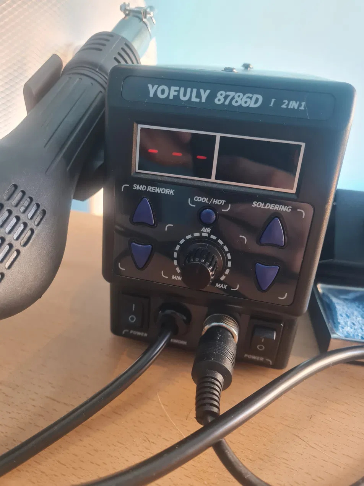

* **Estaño 60/40 con plomo, 1mm:** El de plomo funde a menor temperatura y perdona más, por eso nos va bien para aprender.

* **Malla desoldadora (trenza de cobre):** Absorbe el estaño sobrante por capilaridad. Sirve para limpiar pads y quitar puentes.

* **Flux JBC FL-15:** Ayuda a que el estaño moje y fluya. Sirve para desoldadura también. Ayuda con la transferencia de calor. En desoldadura es obligatorio. 

* **Reactivador de puntas:** Esto no es que sea necesario de primeras. Yo me lo compré porque, obviamente, la primera semana maltraté alguna por pura ignorancia y considero que está bien tenerlo. Sirve para recuperar la punta del soldador cuando se oxida y deja de mojar (no retiene el estaño en la punta. Estañar la punta del soldador es un paso importante).

* **Alcohol isopropílico:** de 96 a 99 de pureza. El que yo tengo es de 99. Sirve para limpiar los residuos del flux al terminar. El flux que yo he indicado de JBC debo decir que no me ha dejado restos (aunque sea buena práctica limpiar siempre), el flux que manchaba era la colofonía del estaño (queda sucio y pegajosa la PCB). 

* **Palillos de esponja:** Para aplicar alcohol y limpiar sin dejar pelusas. Son baratos y se agradece mucho tenerlos. Sumadle algún cepillo de dientes que tengáis para mayor rapidez y amplitud. 

**Herramientas de mano:**

* **Manos de ayuda Goobay:** Este es mi soporte para PCB. Tiene 4 pinzas, ayuda a sujetar la placa mientras tú tienes las manos ocupadas.

* **Alicates de corte diagonal:** Para cortar patas y cables a ras.

* **3 pinzas de precisión ESD:** Para manipular los SMD, que son diminutos. Cuando vayas a desoldar tampoco puedes meter la mano que la temperatura es alta. Las ESD no acumulan carga estática.

* **Gafas de seguridad:** No es ninguna tontería. El estaño a veces salta, no quieres una salpicadura que te vaya al ojo. 

**Instrumentación e interfaces**

* **Multímetro AstroAI:** Para medir voltaje y continuidad. Por 15 euros tienes lo que necesitas. En esta sesión lo hemos usado para comprobar que los condensadores estaban descargados antes de meter calor.

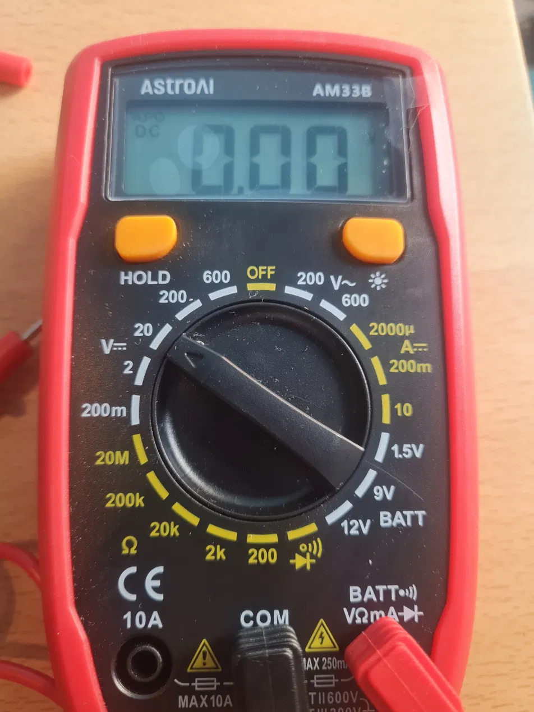

* **Analizador lógico Binghe (8 canales):** Para "ver" señales digitales (por ejemplo un bus, confirmar velocidades). No lo hemos usado en esta sesión pero para el router lo emplearemos.

* **USB-TTL DSD TECH SH-U09C5:** El adaptador USB-TTL. Nos servirá para ver el arranque de un router por UART.

* **Aislador galvánico USB:** Protege el ordenador separando eléctricamente el ordenador del cacharro que analizas. Es un extra, por si el ordenador que usas es el tuyo personal.

* **Programador CH341B con clip SOIC-8 y adaptadores:** Lee y escribe memorias (EEPROM, I2C serie 24 y flash SPI serie 25). Es el que usaremos para volcar la EEPROM al final de esta sesión.

**Prototipado y consumibles**

* **Kit de resistencias ALLECIN:** Un surtido de resistencias con distintos valores para practicar y tener a mano.

* **Cables Dupont ELEGOO:** Los que hacen de puente. Yo tengo los de 20cm, pero son mejores los de 10 cm. Cuanto más largo es el cable, más ruido puede colarse. Si los vas a comprar (que deberías), tenlo en cuenta.

* **Kit de PCB/placa perforada RUNCCi-YUN:** Un kit que te trae bastantes placas perforadas y pines de distintos tipos. Esto es lo que usarás para practicar soldadura.


### Objetivo: la impresora

Es una HP multifunción de inyección de 2006 "Product of Thailand", solo USB (sin red), referencia de placa CB607-80002-A -54.

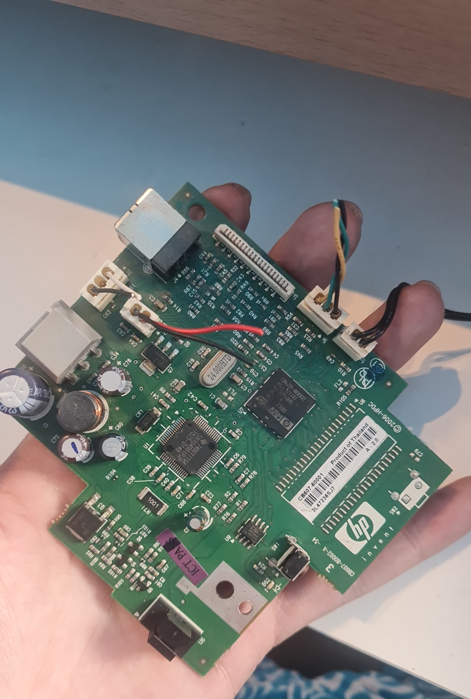

Más adelante veremos la placa con la desoldadura aplicada.

Y hay una segunda PCB, la del carro de tinta, a esta no le vamos a hacer caso pero la dejo como reconocimiento:

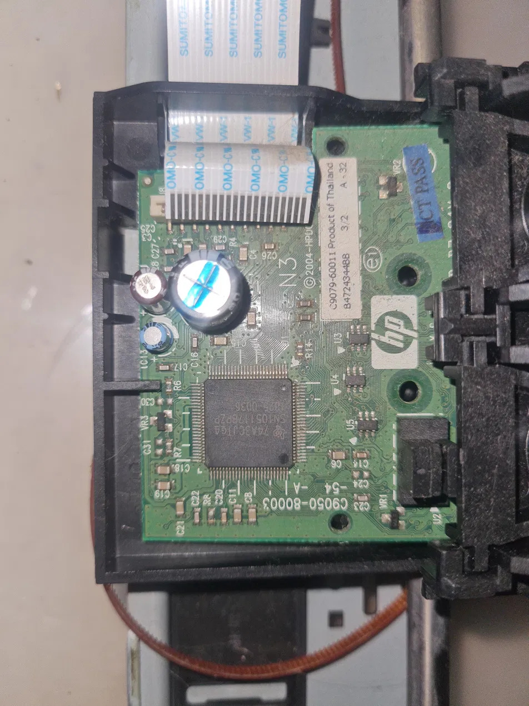


### Por qué la impresora es mal objetivo pero buena práctica

Antes de nada, un poco de teoría que, quizá, debería haber puesto antes.

**¿Dónde vive el firmware y por qué eso decide si un objetivo es bueno o malo?**

La idea básicamente es que un aparato inteligente necesita guardar su sistema operativo/firmware en algún sitio que no se borre al apagarlo. Ese sitio es la memoria no volátil y, según cómo sea esa memoria, el aparato es más o menos fácil de volcar. Podríamos decir que esta es la clave que separa un objetivo bueno de uno malo.

**Resumen que usaremos en otras sesiones también:**

* **Flash SPI (encapsulado SOIC-8):** 4 hilos, se puede pinzar con un clip y volcar con un CH341A o B sin necesidad de desoldar. Es el caso cómodo. Es donde suele estar el firmware. En nuestro caso (que estamos empezando) es una carta genial. Si el aparato no funciona, esta sería la única vía por la que podríamos obtener el firmware. Pero cabe destacar que es mejor empezar por lo que lleva más trabajo (UART/JTAG, reconocimiento..).

* **Flash NOR paralela (TSOP-48):** Más patas, normalmente hay que desoldarla y usar un programador tipo TL866/T48.

* **eMMC/UFS (BGA):** Las bolas están debajo del chip. Es el que suele tener el móvil. Teóricamente, es un nivel más avanzado a la hora de desoldar.

* **Memoria interna del propio chip/encapsulado apilado:** Cuando el fabricante mete la memoria dentro del mismo integrado (o apilada sobre él), no hay ninguna pata externa para engancharse. Es un mal escenario para volcar, y es más o menos lo que nos encontramos en esta sesión.

**Aplicándolo a esta placa**

Cuando miras la PCB de esta impresora, vemos con las explicaciones anteriores que es un mal objetivo. Estos son los motivos:

1. El chip principal es un ASIC de HP fabricado por ST, con núcleo ARM. Muy probablemente es un encapsulado apilado (lógica + memoria). Aunque no podemos confirmarlo solo por la foto (la construcción interna), lo importante es que no hay pata externa para pinzar.

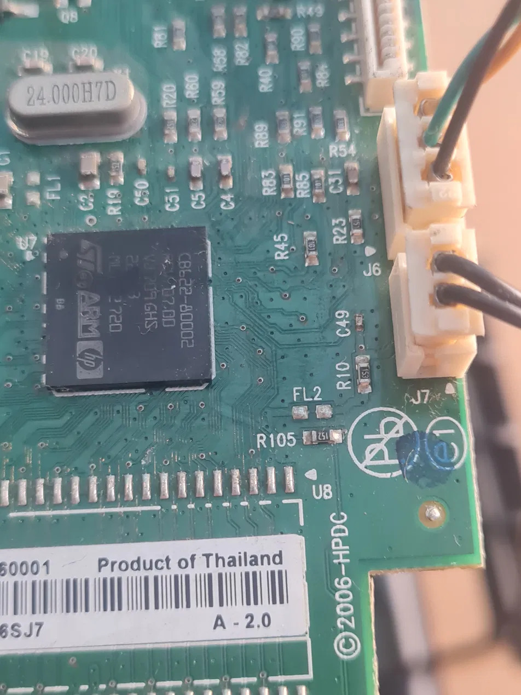

2. Los ASICs son propietarios (por lo que he leído) sin datasheet público (el de HP y los de TI, drivers de motores). Sin hoja técnica es difícil razonar sobre sus pines.

3. No hay superficie de red. Es solo un USB. No hay un sistema operativo incrustado que podamos atacar por wifi o ethernet.

4. La única memoria no volátil externa de la placa es una EEPROM diminuta (la 24C04 que veremos ahora), y guarda la configuración, no el firmware.

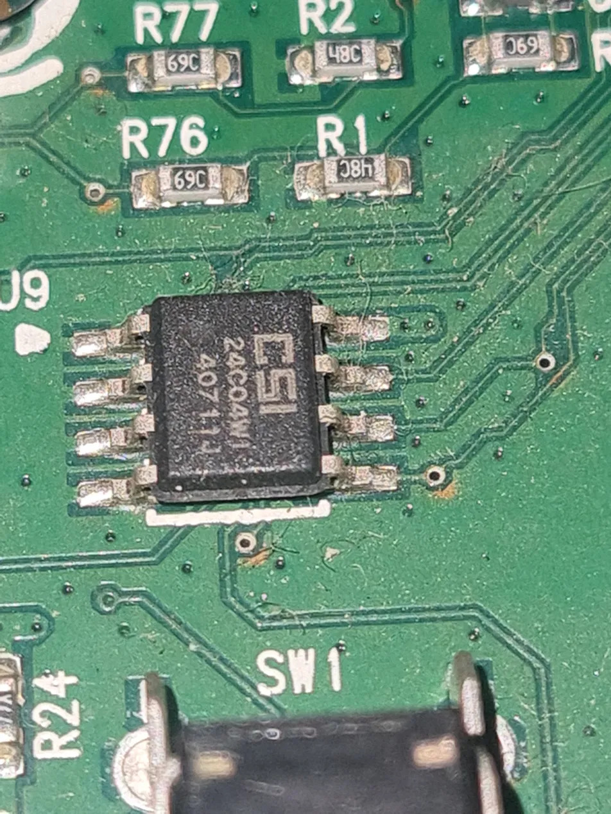

La conclusión, básicamente, es que como objetivo de hardware hacking es flojo, porque lo interesante (el firmware) está donde no podemos llegar y no hay superficie de red. Como campo de prácticas, eso sí, es perfecto (componentes reales, SOIC-8, BGA..).

Algo que quiero añadir. Cuando pensamos en hardware hacking, hay dos caminos en los que podemos pensar. La parte de la derecha es como un medio para un fin (poder extraer firmware, analizar lo que no está público, buscar vulnerabilidades). La otra parte es que, cuando no es posible por ningún medio (bien sea porque está cifrado o el motivo que sea), entonces es donde tenemos las técnicas físicas (side channel attacks, fault injection, glitching... entre otros). Igual que la ingeniería inversa, es un campo complejo y extenso. Tengo pensado traer un objetivo que no está apuntado en la lista en su momento, cuando tenga algo más de material (supuestamente es de los sencillos, pero es donde iremos por hardware más que por software). Lo dejo como sorpresa. Eso sí, no puedo asegurar cuánto tardaré en traerlo. Ahora bien, muchas veces usamos la parte física para poder acceder a la parte del software, no son excluyentes.

### Reconocimiento: identificación de chips

Lo primero de todo es identificar los chips. Un conocimiento previo sobre los componentes o de electrónica, obviamente, son un plus tremendo. Pero si estás centrado en ingeniería inversa (como es mi caso) no deberías temerle, pues la mayor parte girará alrededor del análisis de los binarios. Esto, como la ingeniería inversa, es solo un medio para un fin. Todo lo que vayas sumando, poco a poco, bienvenido sea.

Como pasó en el repo de reversing, puede que me equivoque en algunas cosas al principio (intentaré que sean las menos posibles) y las vaya corrigiendo según adquiera más conocimientos. 

En el momento que tenemos el objetivo identificado, lo que hay que hacer es leer la **serigrafía** de los chips para saber cuál es cada uno y ver cuál es de nuestro interés. ¿Cómo sabemos cuál es de nuestro interés? Depende del objetivo. En esta impresora, como hemos mencionado antes, será la EEPROM; para los routers que vendrán serán los pines UART, el JTAG, la flash... Resumidamente, lo que puedas volcar para el posterior análisis.

Las referencias dudo que las memorice la gente, por lo que no temáis a la consulta. Lees el marcado del chip, lo buscas en internet y con la datasheet razonas qué papel juega. Lo hemos mencionado anteriormente, pero hagamos un repaso de lo que he encontrado en esta placa:

* **ASIC ARM de HP:** CB622-80002 (ST-ARM-hp). Es el cerebro. Encapsulado apilado/BGA.

* **ASIC de Texas Instruments:** SN104961PJP (marcado 74D01TTG4, lote 1825-018). Encapsulado QFP. Por posición y tipo, debe ser el driver de motores. 

* **EEPROM:** 24C04WI de CSI, en la posición U9, junto al pulsador SW1. Es una EEPROM I2C de 512 bytes (4kbit). Este es el objetivo del volcado para esta sesión.

* **Cristal:** 24.000H7D (24MHz). 

### Poniéndonos manos a la obra: desoldadura con aire caliente

Tu seguridad es lo primero, por lo que compruebas la carga de los condensadores (electrolíticos) y los descargas con las resistencias tocando sus patas de abajo (están soldados through-hole). Como guardan carga, pueden reventar con calor directo. Adjunto una foto de un condensador que estaba cerca de donde queríamos operar:

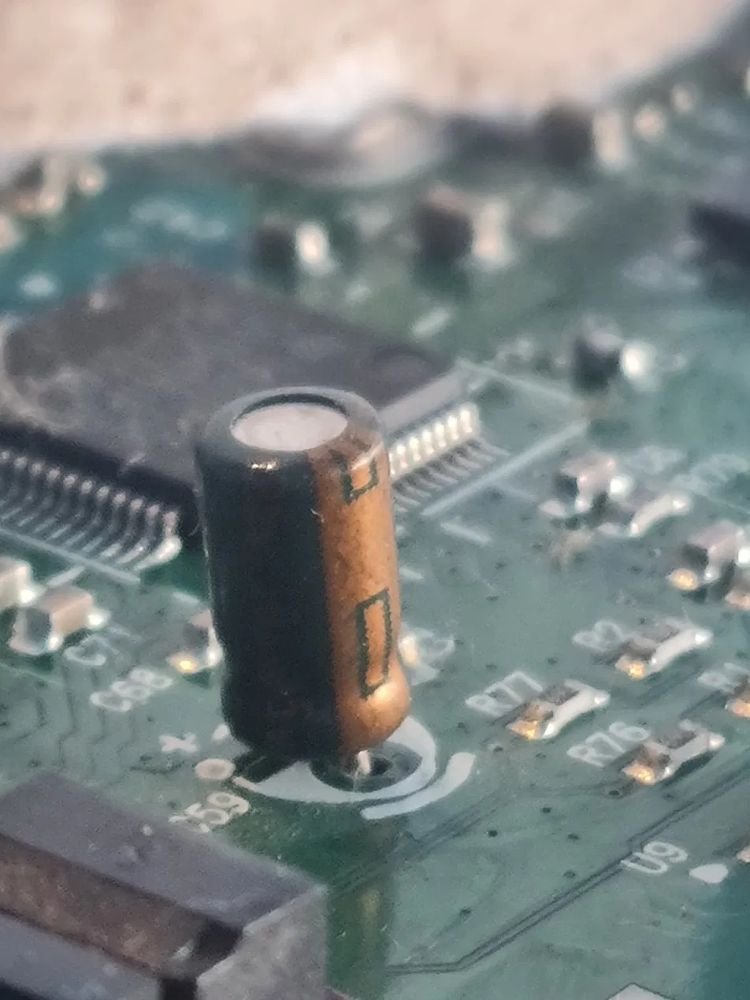

Pongo foto de un pequeño apaño que hice para ese condensador con una funda del multímetro (en la parte de arriba de la foto podemos ver los otros condensadores):

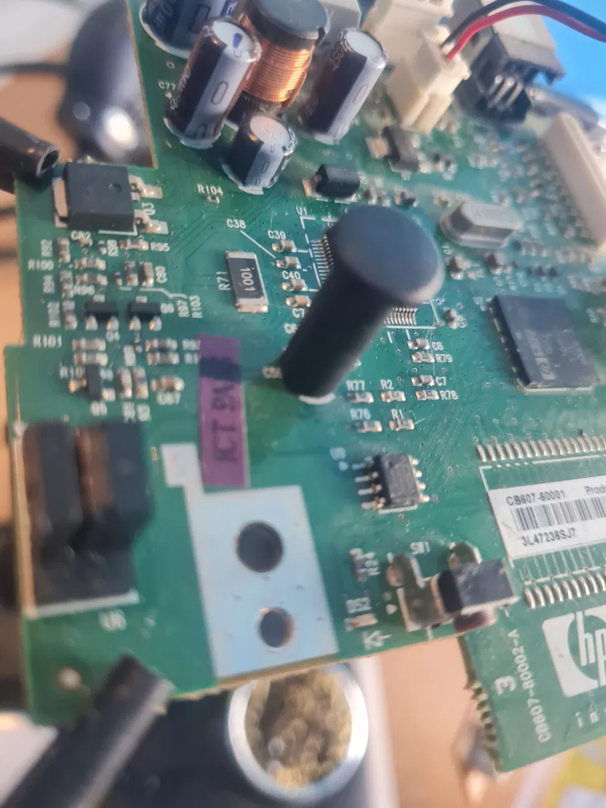

**Estos son los parámetros que me funcionaron en la primera desoldadura que he hecho** (compruébalos antes de darlos como buenos)

* **~340 grados centígrados** para componentes pequeños y la EEPROM SOIC-8.

* **~370-380 grados centígrados** para el SoC BGA.

* **Distancia de la boquilla al componente:** 1-2 cm. Pese a que empecé en 10 y me funcionó, después de leer vi que la cercanía es un factor determinante, ya que no quieres darle a otros componentes. 

* **Movimiento circular** sin quedarte clavado en un punto.

En este momento, para los componentes pequeños hicieron falta 10-15 segundos y para el SoC BGA entre 30-60, tirando más a 60, 45 aproximadamente. Simplemente te fijas en el estaño y, como mucho, vas viendo con un toquecito suave si ya puedes retirarlo, pero nunca debes hacer palanca. 

Por cierto, aplicar flux antes de aplicar calor, te facilitará el proceso.

Estas son las boquillas que tenía, usé la tercera:

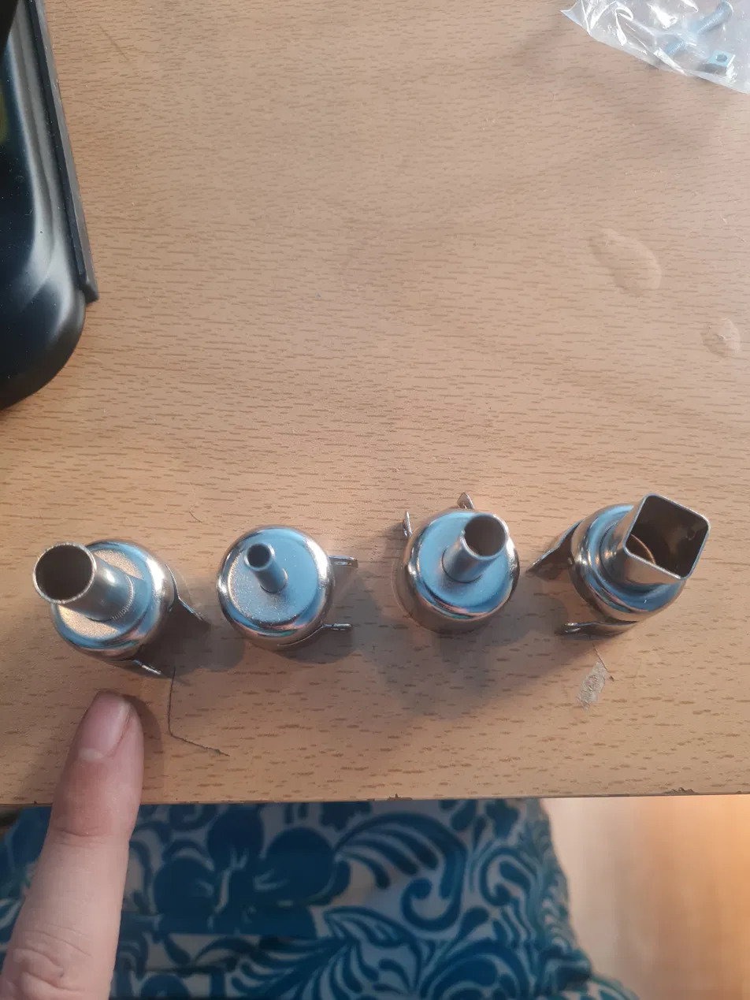.

### Vayamos a la parte del botín

Dicho esto, empecé desoldando transistores y resistencias si no me equivoco (para practicar a ver qué tal). Primero te enseño la zona de prácticas antes de pasar a los chips):

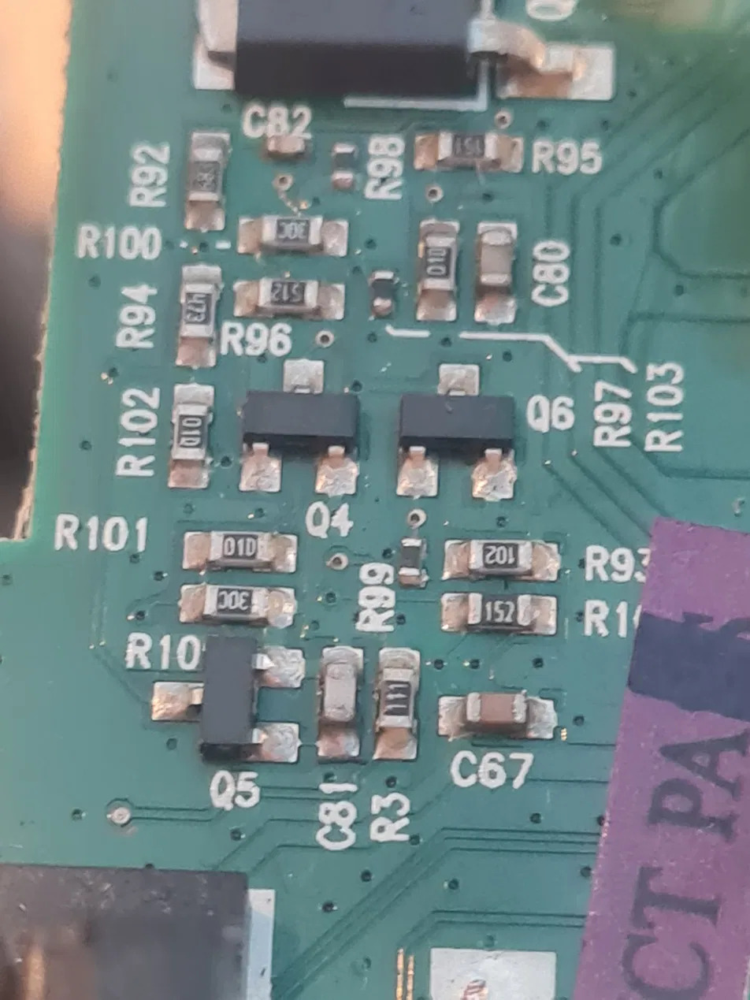

Una foto del primer resultado: 

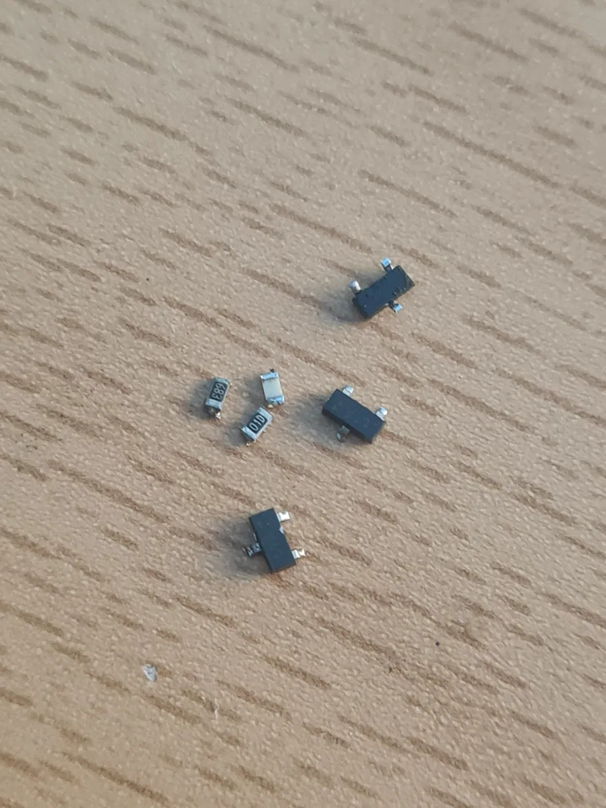

Y te enseño cómo quedó esa zona al final de todo (aunque podrás apreciar que una resistencia con la etiqueta 30C se me quedó, no la vi la verdad):

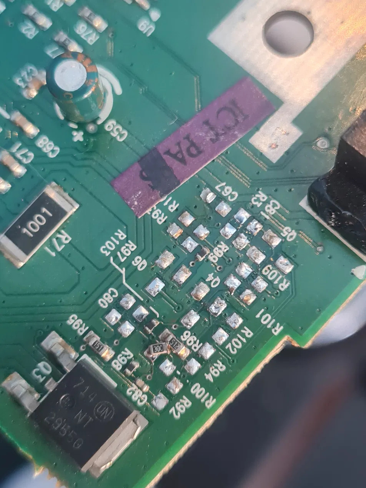

Algo que no he mencionado y voy a hacer. El flux que tengo considero que es bueno, no deja corrosivos ni residuos. No limpié la PCB aunque es buena práctica (podrás ver que no está sucia, pero aún así). Y remarco, meterle bastante flux antes de desoldar que te ayudará en el proceso.

Luego, con la emoción de haber salido todo bien, me lancé a por la EEPROM (nuestro objetivo posterior de volcado). Misma temperatura, mismo método (flux, esperar a que se caliente la pistola, calentar a 1-2cm de manera circular). Este es el resultado (pongo primero la EEPROM por si no recordamos qué chip era):


Ahora pongo la placa después de la desoldadura y sin limpieza posterior (ya que no iba a volver a soldar y la PCB, si no la guardo como recuerdo, la tire):

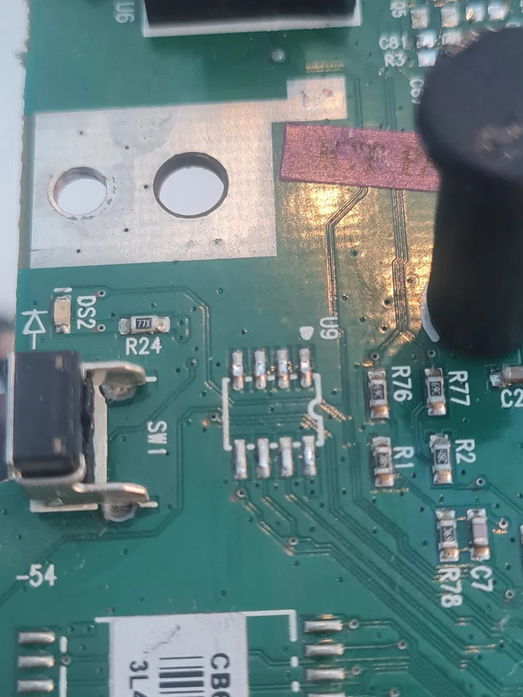

Y pongo foto también de la EEPROM desoldada:

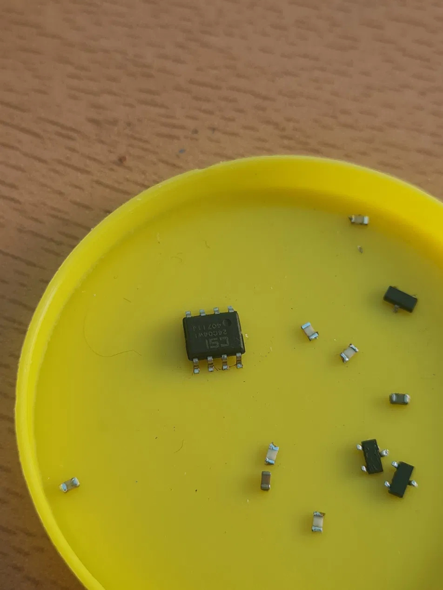

Y, por último, el más complicado, el SoC BGA. La verdad es que se ha desoldado bastante limpio. Y aquí tampoco hemos limpiado la placa posteriormente. Dicho esto, aquí subí la temperatura a 375. Podría haber usado la punta del soldador cuadrada sin problema, ya que cubre más zona. Como con el EEPROM, pongo foto del SoC y luego la zona desoldada, para posteriormente enseñar el chip:


La zona después de desoldar:

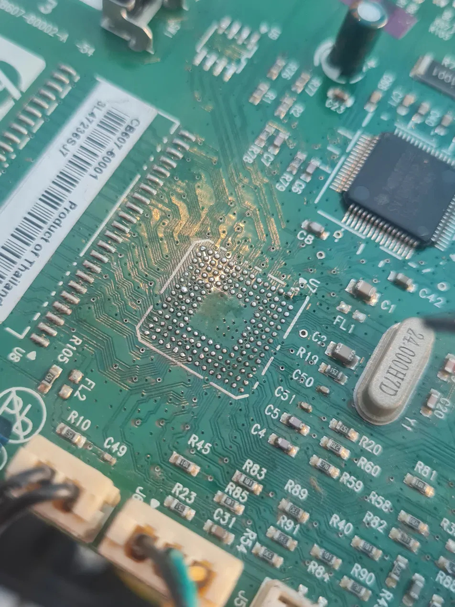

Y, por último, enseño el chip:

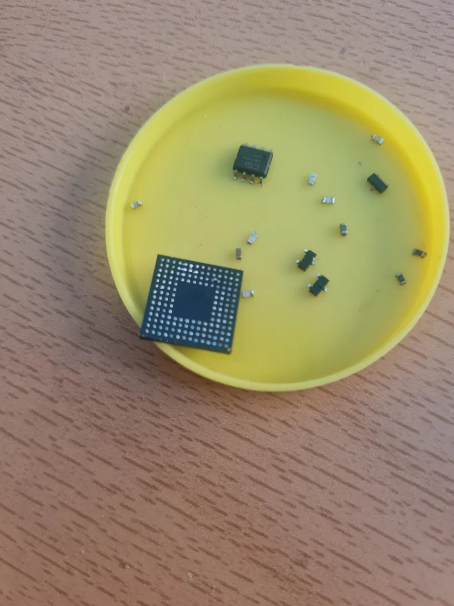

### Notas soldadura

Pese a que la desoldadura la he disfrutado como un niño por no haber presentado tantos problemas, me gustaría añadir este apartado para el que esté empezando. 

Lo primero de todo es el estañar la punta. Esto es por salud de la propia punta como tal. En contacto con el aire, una punta tan caliente se oxida. Por lo que estañar la punta es obligatorio, el estaño te sirve de capa protectora.

Debes empezar con poca temperatura e ir subiendo gradualmente hasta encontrar la temperatura donde calientas el pin y pad en pocos segundos, luego puedas añadir el estaño tocando pin y pad y funda. Dicho esto, a mí no me ha servido. Yo en la mayoría de temperaturas, aún así, debía dejar la punta del soldador unos 7 segundos antes de poner el estaño, y no era directamente sobre pin y pad porque ahí no fundía, era tocando los 3: pin, pad y punta de soldador (pero la parte que está estañada. Al estar ya fundido, la transferencia de calor es instantánea). Luego, a la hora de soldar tampoco debes tener mucho estaño en la punta. Al menos, en mi caso, las veces que tenía bastante ocurría algo. Pongo el ejemplo de 340 grados. En el momento que acercaba la punta estañada con una capita gorda de estaño, el estaño absorbía la temperatura a la que estaba el pin y pad, y se solidificaba momentáneamente, haciendo que la soldadura fuera no solo fea, si no con pegotes malos. 

Lo que tienes que tener en cuenta es que el estaño se adherirá solo al pin y pad quedándose en forma de volcán si están calientes. Un error que podrías cometer es intentar poner el estaño cuando todavía no están lo suficientemente calientes, por lo que te saldrá también el churro. 

Quiero pensar que es por no usar flux o por el PID. En teoría, mi estación de soldadura tiene el PID en el mango, no en la punta. En el momento que entra en contacto (esto es una hipótesis), absorbe un poco la temperatura del pin y pad y, al ser mucho menor, la absorbe la punta, haciendo que baje grados. Como el PID está en el mango, puede notarlo más tarde, por lo que la corrección no es instantánea. Esto es un problema y quizá explique por qué yo, en todas mis soldaduras, debía aguantar 7-8 segundos en las temperaturas razonables de fusión (entre 320 y 360 grados). Solo me funcionaba lo de los vídeos que puedes ver en tutoriales en el momento de subir la temperatura a unos 400 grados, lo cual me parece una locura y para la salud de la punta va fatal, se te oxidará muchísimo más rápido. 

Así que el problema yo diría que es la transferencia de calor. 

Así que después de investigar y razonar por mi propia cuenta, adquirir un método decente y, sobre todo, entender por qué ocurría todo, estas son las que hice seguidas decentes el sábado con la teoría ya probada, a unos 356-366 grados (y debo decir que les falta brillantez):

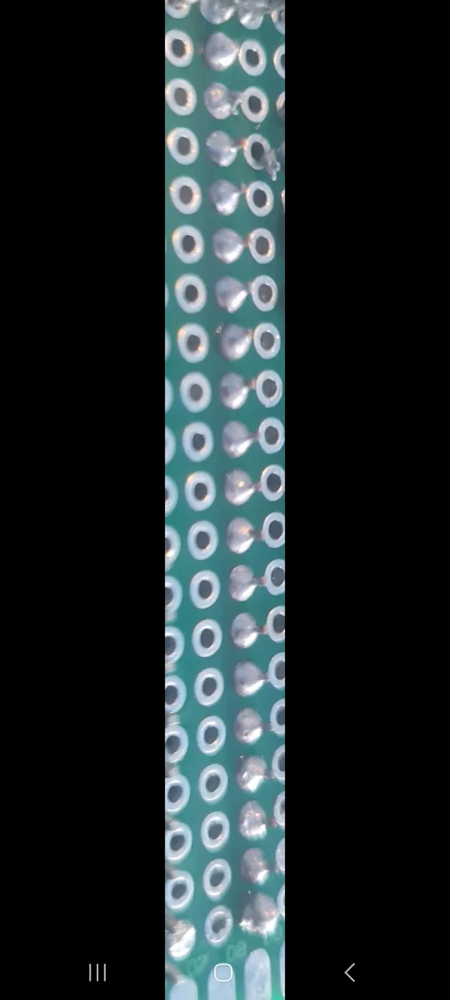

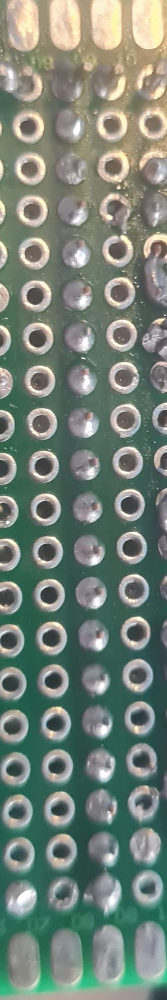

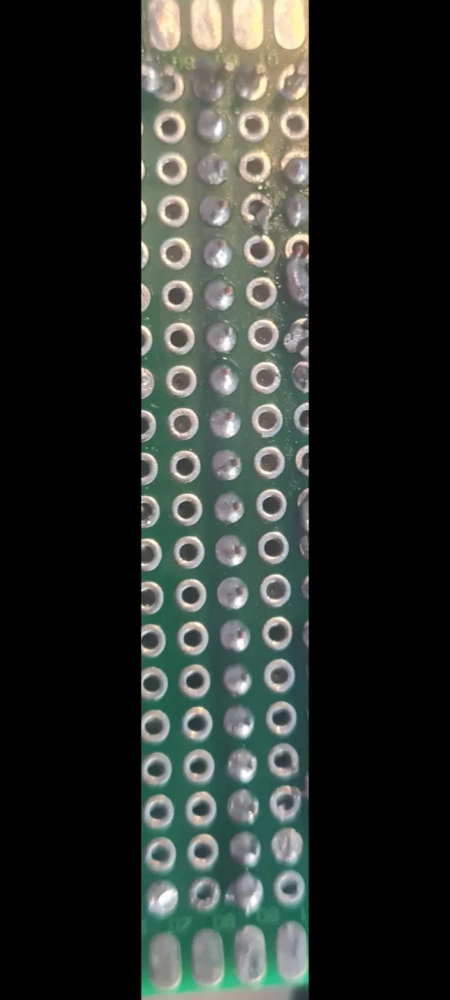

Y las que me han salido mal, entre tantas. Y me atrevería a decir incluso que, pese a que me dé vergüenza de subir, no son las peores. Esto tiene que ver con la transferencia de calor que comentaba, acercar el estaño antes de tiempo, no entender bien tu estación de soldadura... En estas fotos podréis apreciar lo que comentaba de la colofonía además. Son tomadas sin ningún tipo de limpieza, por lo que podéis ver el resto en la placa, pegajoso. Y muchas de ellas han sido probando para afinar.

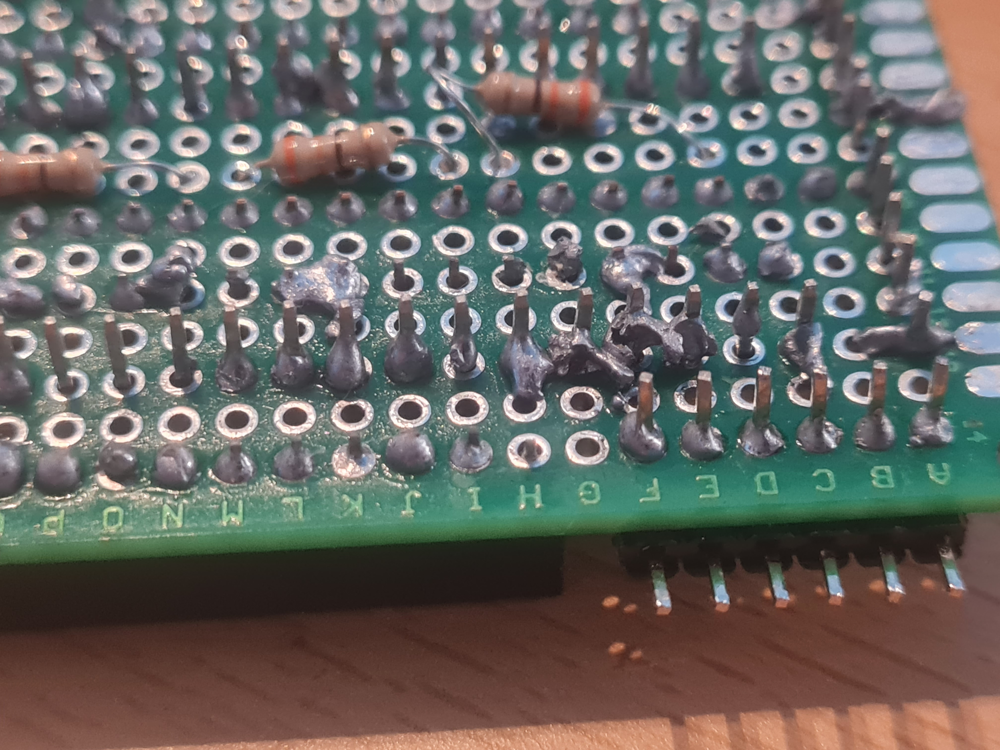

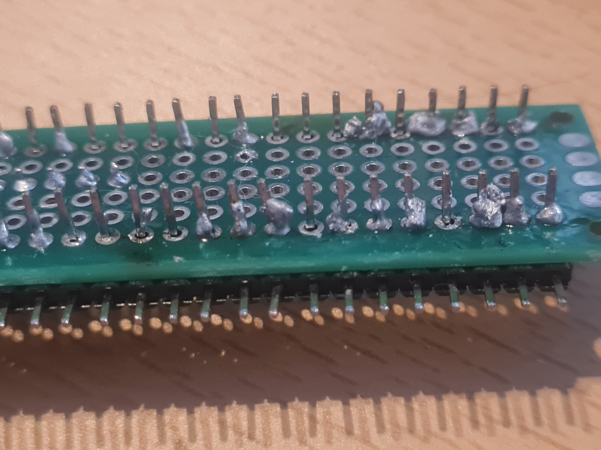

### El volcado de la EEPROM

Bueno, empecemos por la parte de mostrar la herramienta que usaremos para ello, luego explicaré qué es lo que debemos clonar. Para empezar, pongo una vista general del conjunto que nos venía con el programador. Debo añadir que es un CH341A, no B, comprobado por la parte trasera del mismo (en la descripción del producto ponía B, por eso la confusión. Nos sirven por igual):

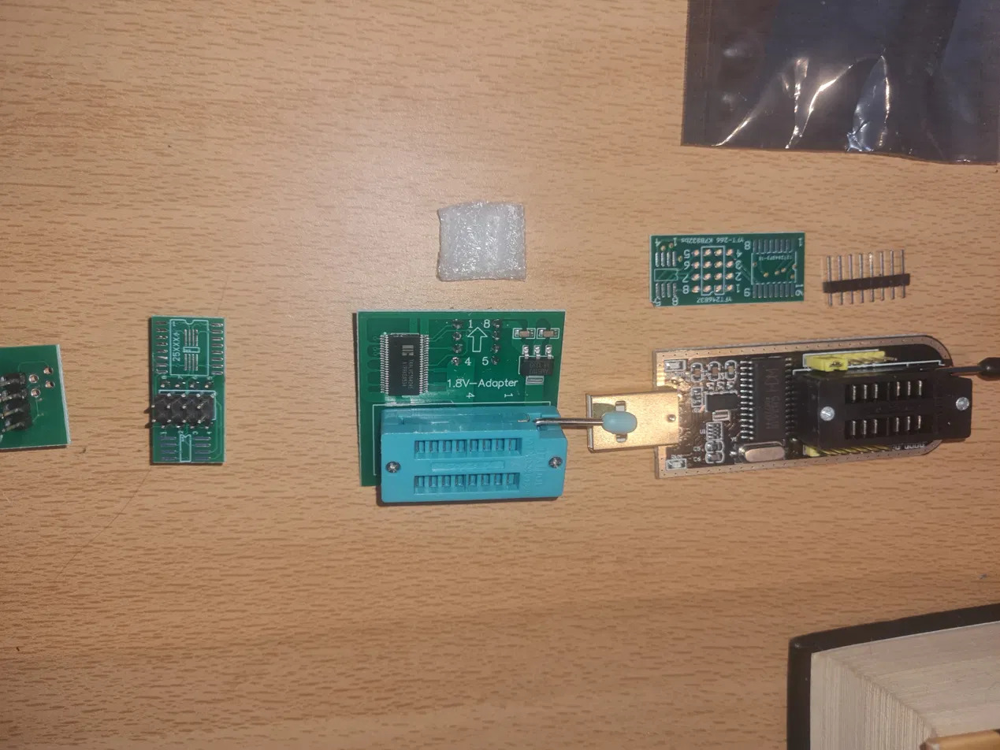

También el zócalo, que lo muestro aparte porque es lo que vamos a usar para esto:

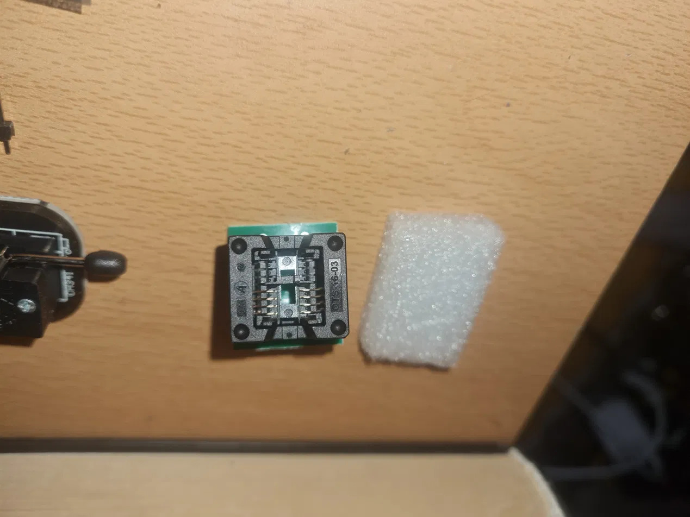

Y en el conjunto también nos vienen unas pinzas con un clip para no tener que desoldar:

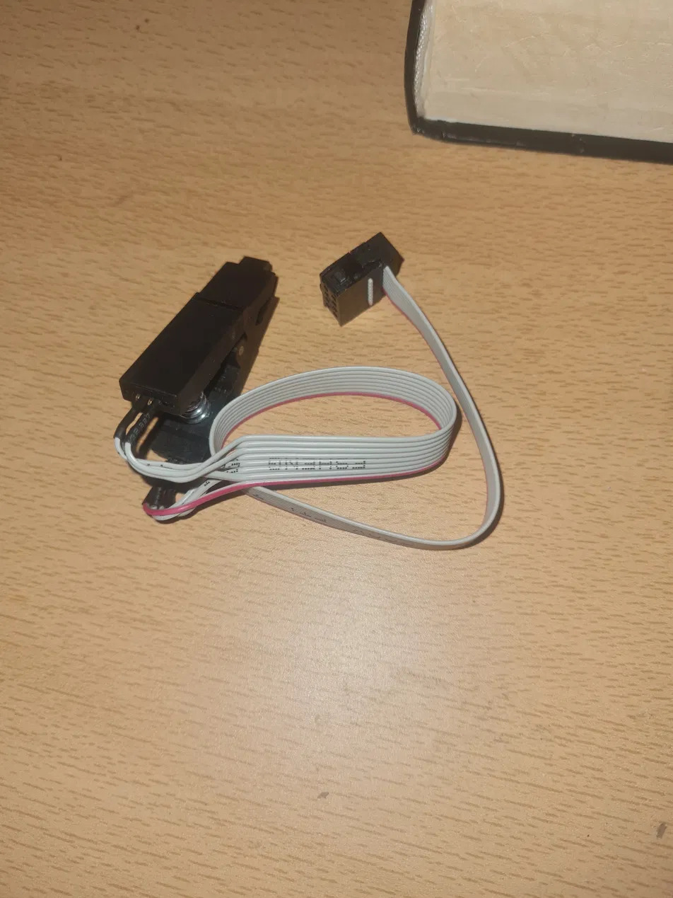

Pongo también el programador, tanto por arriba como por debajo:

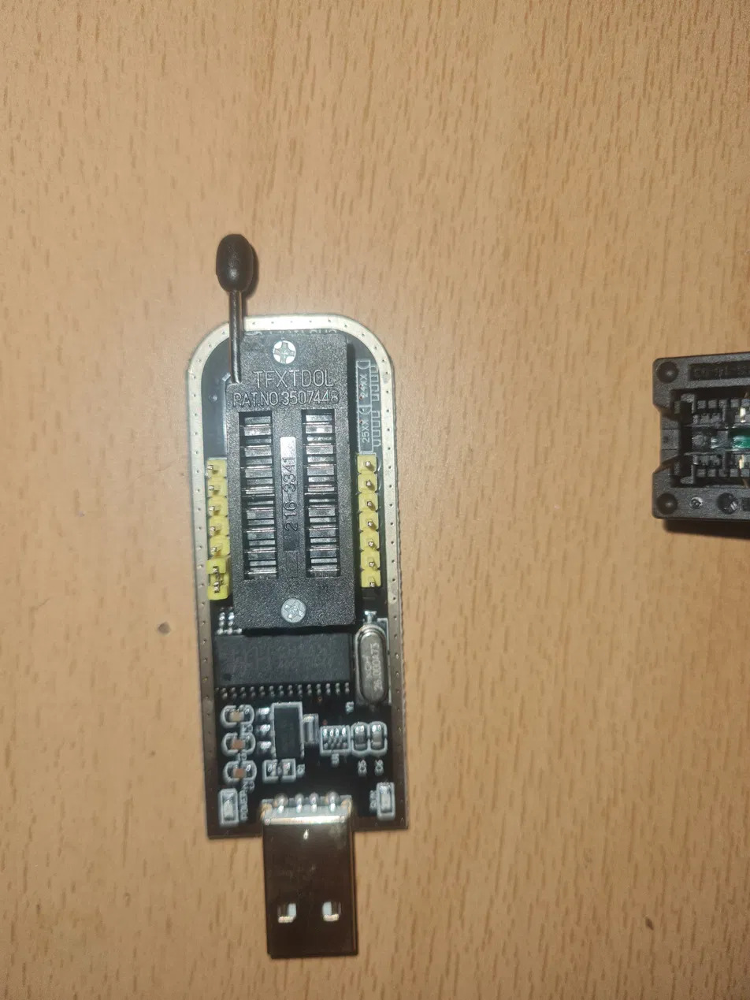

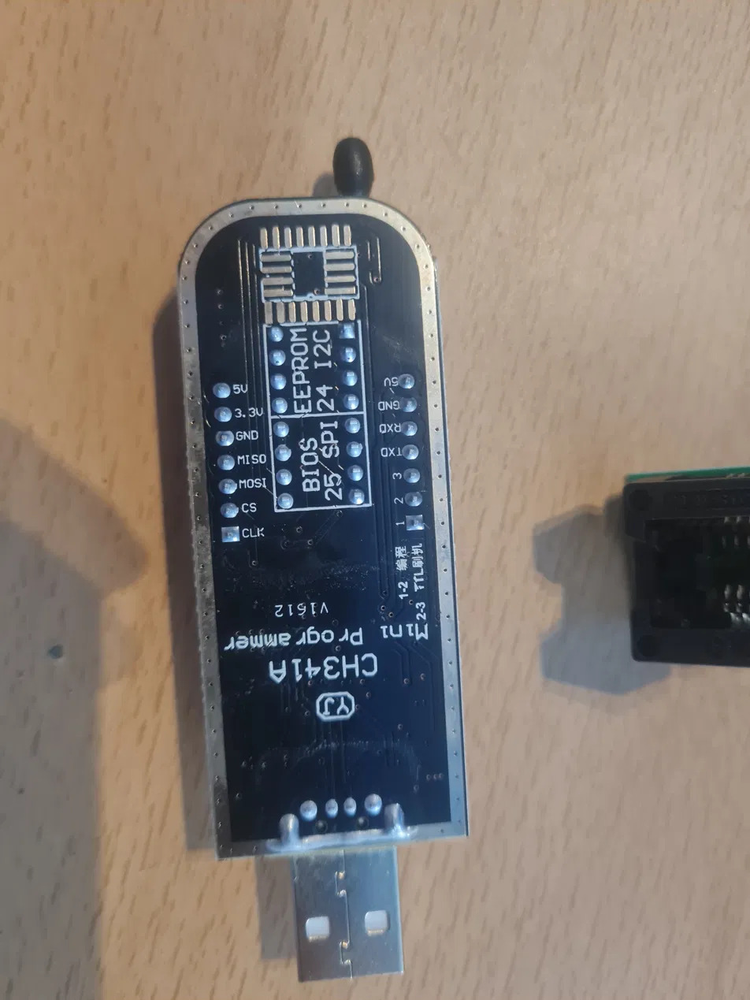

Teniendo esta parte ya mapeada, me gustaría añadir algo. La verdad que ha sido un poco "pelea" al principio para hacer que todo corra bien o como queremos. Dicho esto, también hemos tenido que medir el voltaje por el que salía. En la parte de atrás del programador nos indica cuál pin es cuál. Debemos poner la punta del multímetro negra en el GND y la roja en el de 5v y en la otra parte en el de 3.3v . La preocupación en esta parte es que, por defecto, estos programadores salen a 5v (por cierto, después de comprobarlo, los pines más cerca de la palanca salían entre 4.75-5.20v), y para cuando vayamos con routers muchos chips funcionan a 3.3v, por lo que podríamos freírlo, en teoría. Ya veré en su momento cómo se hace. En el caso de esta EEPROM no hay problema porque tolera 5.5v . 

Como vemos en la parte posterior del programador, la pieza que acepta el zócalo está compuesta por 2 secciones por así decirlo: BIOS 25 SPI y EEPROM 24 I2C. Es decir, soporta las dos familias. 

En estos programadores, he leído que el pin o pata que corresponde a la primera posición es el que va más cerca de la palanca de la pieza que sujeta el zócalo. Para identificar cuál es la primera pata, deberías leer la serigrafía de manera normal (que no esté al revés ni nada) y una de las dos puntas debería tener una pequeña muesca que nos indique que es la primera pata. Adjunto foto con el chip ya metido en el zócalo:

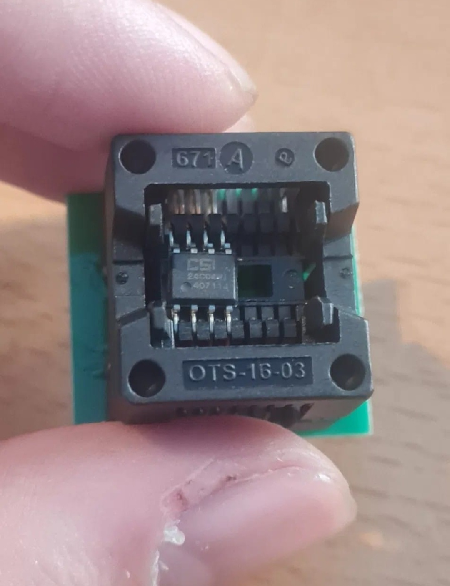

Como se puede apreciar en la foto, la muesca de la que hablo está en la parte de abajo a la izquierda. 
Una vez hecho esto, simplemente debemos subir la palanca que está en el programador para conectar el zócalo en las ranuras que corresponden al EEPROM 24 I2C en este caso. Pongo foto conectado al puerto ya:

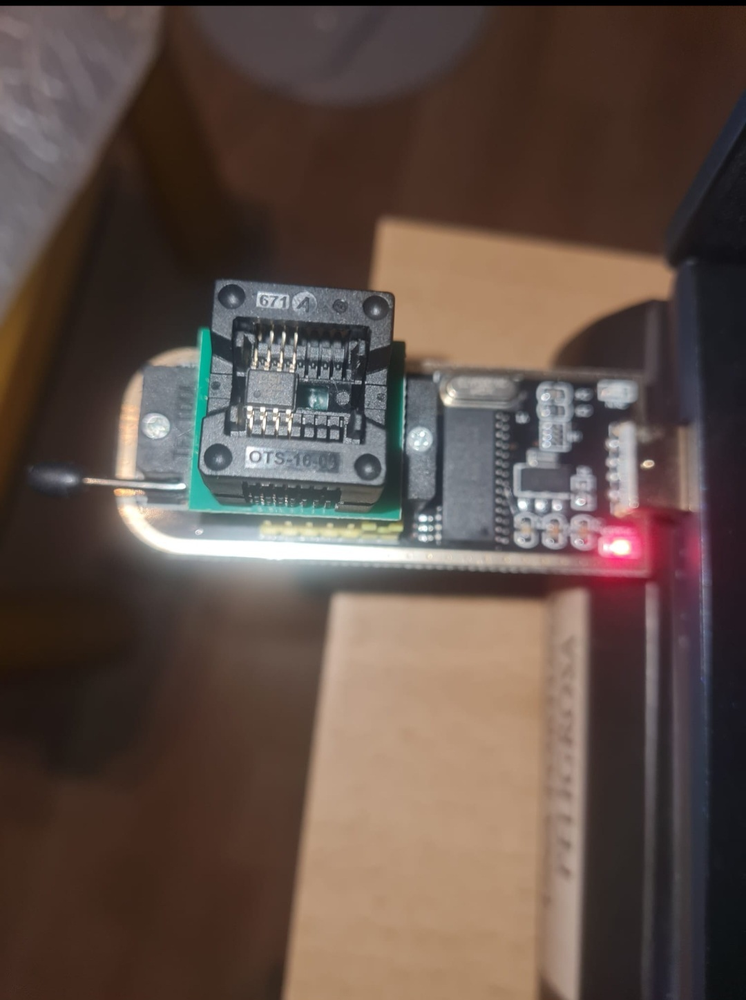

Vale, ahora que tenemos esta parte, vamos por la parte del software, que tenemos que clonar un repositorio. Os pongo todos los comandos en la misma viñeta:

```bash
sudo apt install build-essential libusb-1.0-0-dev git
git clone https://github.com/command-tab/ch341eeprom
cd ch341eeprom && make
```

No he tenido ningún error de compilación ni nada por el estilo. En mi caso, en el directorio creado para clonar el repositorio y poder tener el binario, he creado un subdirectorio llamado análisis en el que separaré todos los análisis según los haga, por comodidad. Este binario no se mete automáticamente en el path, no lo verás con el comando `which` a no ser que lo metas tú. No es ningún inconveniente. 

Dejando de lado la carpeta de análisis, esto es lo que deberías ver:

```bash
ls -l
.rw-rw-r-- ygm ygm 248 B  Tue Sep  1 16:09:51 2026  99-CH341.rules
drwxrwxr-x ygm ygm  32 B  Tue Sep  1 20:33:44 2026  analisis
drwxrwxr-x ygm ygm 178 B  Tue Sep  1 16:09:51 2026  ch341docs
.rwxrwxr-x ygm ygm  32 KB Tue Sep  1 16:10:05 2026  ch341eeprom
.rw-rw-r-- ygm ygm  12 KB Tue Sep  1 16:09:51 2026  ch341eeprom.c
.rw-rw-r-- ygm ygm  22 KB Tue Sep  1 16:09:51 2026  ch341eeprom.h
drwxrwxr-x ygm ygm  68 B  Tue Sep  1 16:09:51 2026  ch341eeprom.xcodeproj
.rw-rw-r-- ygm ygm  17 KB Tue Sep  1 16:09:51 2026  ch341funcs.c
.rw-rw-r-- ygm ygm  34 KB Tue Sep  1 16:09:51 2026  COPYING
.rw-rw-r-- ygm ygm 3.4 KB Tue Sep  1 16:09:51 2026  Makefile
.rwxrwxr-x ygm ygm  16 KB Tue Sep  1 16:10:06 2026  mktestimg
.rw-rw-r-- ygm ygm 2.5 KB Tue Sep  1 16:09:51 2026  mktestimg.c
drwxrwxr-x ygm ygm 124 B  Tue Sep  1 16:09:51 2026  pics
.rw-rw-r-- ygm ygm 2.9 KB Tue Sep  1 16:09:51 2026  README.md
drwxrwxr-x ygm ygm 314 B  Tue Sep  1 16:09:51 2026  windowsonlysoftware
drwxrwxr-x ygm ygm 146 B  Tue Sep  1 16:09:51 2026  wiresharkusbsniffing
```

Teniendo ya el binario (le puedes crear un alias o ponerlo en el path, como tú veas), debemos ejecutar este comando:

```bash
sudo ./ch341eeprom -s 24c04 -r dump1.bin
```

Esto es lo que nos devuelve:

```bash
Read [512] bytes from [24c04] EEPROM
Wrote [512] bytes to file [dump1.bin]
```

Este comando lo que hace es decirle con la flag -s el tamaño/tipo de EEPROM que va a leer, y lo sabemos por la serigrafía del propio chip. Para saber qué tipos admite puedes ejecutar el binario sin argumentos o con -h. 

Ahora, antes de mirar lo que hay dentro, vamos a hacer un segundo volcado para comprobar la integridad del mismo. Ejecutamos el mismo comando con el nombre dump2.bin (por ejemplo). Si ha sido estable el volcado, al comprobar sus hashes, deberían ser idénticos:

```bash
md5sum dump1.bin dump2.bin

2d845091c92109e6e3bebcac79a9b264  dump1.bin
2d845091c92109e6e3bebcac79a9b264  dump2.bin
```

¡Genial! Parece que todo ha salido bien a primera vista. No tiene por qué estar correcto, pero la lectura ha sido estable.

Ya con el volcado, podemos usar el comando xxd o abrirlo con el editor de texto nvim por ejemplo, con la flag -b para decirle que estamos en modo binario. En el repo de reversing suelo usar la segunda opción, aunque he comprobado ambas. Por comodidad, puedes usar simplemente xxd dump1.bin > dump_hex.txt, sin más. 

Vamos a usar la última opción mencionada por simpleza:

```bash
cat dump_hex.txt 
───────┬──────────────────────────────────────────────────────────────────────────────────────────────────
       │ File: dump_hex.txt
───────┼──────────────────────────────────────────────────────────────────────────────────────────────────
   1   │ 00000000: 0000 0000 0000 0000 0000 0000 0000 0000  ................
   2   │ 00000010: 0000 0000 0000 0000 0000 0000 0000 0000  ................
   3   │ 00000020: 0000 0000 0000 0000 0000 0000 0000 0000  ................
   4   │ 00000030: 0000 0000 0000 0000 0000 0000 0000 0000  ................
   5   │ 00000040: aced 01fd 03f1 0346 0471 0401 05bd 0280  .......F.q......
   6   │ 00000050: 6410 0181 5000 0000 00d0 0400 0180 1f0a  d...P...........
   7   │ 00000060: 9e24 c20d 1ae4 17e6 1deb 1fe9 0005 0000  .$..............
   8   │ 00000070: ffe5 fc57 fdee fec4 fb08 f6cb f271 eee5  ...W.........q..
   9   │ 00000080: ecf4 eb4c f48b 01a1 e96f fa3a fe61 fa80  ...L.....o.:.a..
  10   │ 00000090: ff39 fe2f 02fa 0835 0000 0000 2658 fbbc  .9./...5....&X..
  11   │ 000000a0: 8900 1560 3720 0200 3f00 5000 0a00 4640  ...`7 ..?.P...F@
  12   │ 000000b0: 1d40 3d44 f4a9 21bb 696c 98c3 aec5 834b  .@=D..!.il.....K
  13   │ 000000c0: 2ca4 5009 132f 3d7a b2f4 4111 8b46 0c10  ,.P../=z..A..F..
  14   │ 000000d0: 73cb cb4e 5e60 00fc 011e 4500 4e43 541e  s..N^`....E.NCT.
  15   │ 000000e0: 0868 46c6 6688 2886 2686 c61f 4198 0357  .hF.f.(.&...A..W
  16   │ 000000f0: 0e41 ffff ffff ffff ffff ffff ffff ffff  .A..............
  17   │ 00000100: 0000 0000 0000 0000 0000 0000 0000 0000  ................
  18   │ 00000110: 0000 0000 0000 0000 0000 0000 0000 0000  ................
  19   │ 00000120: 0000 0000 0000 0000 0000 0000 0000 0000  ................
  20   │ 00000130: 0000 0000 0000 0000 0000 0000 0000 0000  ................
  21   │ 00000140: aced 01fd 03f1 0346 0471 0401 05bd 0280  .......F.q......
  22   │ 00000150: 6410 0181 5000 0000 00d0 0400 0180 1f0a  d...P...........
  23   │ 00000160: 9e24 c20d 1ae4 17e6 1deb 1fe9 0005 0000  .$..............
  24   │ 00000170: ffe5 fc57 fdee fec4 fb08 f6cb f271 eee5  ...W.........q..
  25   │ 00000180: ecf4 eb4c f48b 01a1 e96f fa3a fe61 fa80  ...L.....o.:.a..
  26   │ 00000190: ff39 fe2f 02fa 0835 0000 0000 2658 fbbc  .9./...5....&X..
  27   │ 000001a0: 8900 1560 3720 0200 3f00 5000 0a00 4640  ...`7 ..?.P...F@
  28   │ 000001b0: 1d40 3d44 f4a9 21bb 696c 98c3 aec5 834b  .@=D..!.il.....K
  29   │ 000001c0: 2ca4 5009 132f 3d7a b2f4 4111 8b46 0c10  ,.P../=z..A..F..
  30   │ 000001d0: 73cb cb4e 5e60 00fc 011e 4500 4e43 541e  s..N^`....E.NCT.
  31   │ 000001e0: 0868 46c6 6688 2886 2686 c61f 4198 0357  .hF.f.(.&...A..W
  32   │ 000001f0: 0e41 ffff ffff ffff ffff ffff ffff ffff  .A..............
```

El problema es que la impresora la he tirado ya, por lo que con esto no podemos comprobar qué byte corresponde a qué (el del contador por ejemplo. Imprimiendo una página y usando el comando diff para ver qué ha cambiado). Lo único que puedo ver es que hay 2 estructuras que se repiten (la primera empieza en la línea 1 y termina en la 16, la segunda empieza en la 17 y termina en la 32). Si no, para comprobar, también podríamos mirar la datasheet, pero el formato que HP escribe dentro no es público.  

Lo único que puedo decir más o menos después de haberlo mirado es el motivo por el que las dos estructuras se repiten. Lo más probable es redundancia y por seguridad. Escribir en una EEPROM no es instantáneo, y si al aparato se le va la corriente justo mientras están escribiendo su configuración, esa copia quedaría corrupta. Guardando las dos copias, el firmware siempre tiene una válida. La otra posibilidad es por desgaste (wear leveling). Como las EEPROM tienen un número limitado de escrituras por celda, algunos diseños alternan entre dos zonas para repartir el desgaste y que duren más.

Dicho esto, las dos posibilidades que doy asumen que el volcado refleja lo que hay en el chip. Podría ser producto de cómo la herramienta lee esta EEPROM en concreto también. No sé lo suficiente todavía para descartarlo, y ya no tengo la impresora, así que queda abierto.

**Sección añadida a posteriori**

Repasando este writeup con un LLM, me señaló que la explicación que yo había dejado abierta al final del apartado anterior (que el duplicado pudiera ser artefacto de la herramienta) tenía un mecanismo concreto detrás. He vuelto al laboratorio a comprobarlo y resulta que hay resultados distintos. Voy a dejarlo apuntado por si me puede servir para el futuro al volver a leerlo.

Esta explicación no es mía, pero la voy a dejar apuntada igualmente.

El volcado de 512 bytes salía con dos estructuras idénticas, una en la primera mitad y otra en la segunda, y las explicaciones que yo di con mis conocimientos actuales era posible redundancia o wear leveling, o que las dos asumían que el volcado reflejaba lo que hay en el chip. 

Resulta que no lo reflejaba. Vamos por partes.

Por la serigrafía sabíamos que la 24C04 guarda 512 bytes, hasta aquí bien. Lo que no sabía es que por dentro no son 512 posiciones seguidas. Están partidos en dos bloques de 256 bytes, y el chip solo puede exponer uno de los dos a la vez. El LLM ponía un ejemplo de tomarlo como un archivador con dos cajones de 256 casillas cada uno; y para pedir una casilla tienes que decir dos cosas: qué cajon y qué casilla dentro del cajón.

El motivo es que la casilla se pide con un byte, y un byte solo llega hasta 255. Falta un bit en alguna parte. Y ese bit lo meten dentro del byte de dirección del dispositivo, el que mandas por el bus I2C para identificar con quién estás hablando antes de pedir nada.

```text
  bit:    7   6   5   4    3    2    1     0
          1   0   1   0    A2   A1   P0   R/W
          └──── ┬ ────┘   └─ ┬ ─┘    │     └── 0 = escribir, 1 = leer
            prefijo fijo    pines    │
           "soy una EEPROM"  de      └── ESTE elige el bloque
                          dirección       0 = bytes 0..255
                                          1 = bytes 256..511

```

Ese P0 que nos indica el LLM es la clave de todo lo que viene. Son dos bytes distintos que se mandan uno detrás de otro, y el bit del bloque viaja en el primero. Así que para leer el chip entero la herramienta tiene que hacer dos pasadas: P0 a 0 y leer 256 casillas, luego P0 a 1 y leer otras 256. Como digo, P0 vive en el byte de dirección del dispositivo, no en el byte del número de casilla.

La causa exacta es un OR que deja el bit clavado. ch341eeprom tiene en ch341eeprom.h una tabla con una fila por modelo del chip. La de la nuestra es esta:

```c
{ "24c04",   512,    16,  1, 0x01},   // el ultimo campo es 'addr'
```

Y en ch341funcs.c dentro de ch341ReadCmdMarshall(), el bit del bloque se calcula así:

```c
msb_addr = (addr>>8 & 7) | eeprom_info->addr;
//          └──── el bit que TOCA ────┘   └── ese 0x01 de la tabla
//           segun donde estemos leyendo
```

Es un OR. Y cualquier cosa OR 1 da 1, siempre. Así que msb_addr vale 1 pase lo que pase, y el bit del bloque se queda clavado en 1 en las dos pasadas.

La consecuencia de todo esto es que la herramienta pidió el bloque de arriba en las dos pasadas. Mi fichero de 512 bytes era el mismo bloque de 256 pegado consigo mismo. El bloque de abajo no se pidió nunca. Por eso las dos mitades salían idénticas hasta el último byte, por lo que era el programador preguntando dos veces lo mismo. Y, por cierto, el propio repositorio upstream es consciente de que la ruta está rota. Hay un commit titulado *"Restores the same broken 9-11 and 17 bit functionality for writing".*

**Cómo se soluciona**

La herramienta tiene una flag -c/--chip-select que machaca ese campo de la tabla. Poniéndolo a 0, el OR deja de estorbar y el bit sale limpio del offset:

```bash
sudo ./ch341eeprom -s 24c04 -c 0 -r dump_c0.bin
```

```text
Read [512] bytes from [24c04] EEPROM
Wrote [512] bytes to file [dump_c0.bin]
```

El orden de las flags importa en este caso. `-s 24c04` copia la fila entera de la tabla a memoria, incluido ese campo. Si escribes -c 0 -s 24c04, el -s se ejecuta después y te vuelve a meter el 0x01, dejándote como estabas. Tiene que ir -s primero y -c después. 

Si prefieres no depender del orden, la alternativa es cambiar el 0x01 por 0x00 en la tabla de ch341eeprom.h y recompilar.

**La comprobación**

Como no me quería quedar con un solo volcado nuevo y darlo por bueno, hicimos 3 cosas.

1. Estabilidad. Dos lecturas seguidas con -c 0, hashes idénticos. La lectura era estable, igual que en el apartado anterior.

2. Las mitades ya no coinciden. Ahora, solo se mantiene la segunda parte de la estructura.

3. El control, que es la prueba definitiva. Forzamos el bit 1 a mano, es decir, le pedimos explícitamente a la herramienta que haga lo que se sospechaba que hacía sola:

```bash
sudo ./ch341eeprom -s 24c04 -c 1 -r dump_c1.bin
md5sum dump_c1.bin dump1.bin
```

```bash
2d845091c92109e6e3bebcac79a9b264  dump_c1.bin
2d845091c92109e6e3bebcac79a9b264  dump1.bin
```

Reproduce el fichero original clavado. Si el comportamiento por defecto se reproduce pidiendo a mano lo incorrecto, entonces el comportamiento por defecto era incorrecto. 

**El volcado bueno**

Aquí están los 512 bytes reales del chip (lo he convertido antes a hex con nvim):

```bash
cat dump_c0.bin
───────┬──────────────────────────────────────────────────────────────────────────────────────────────────
       │ File: dump_c0.bin
───────┼──────────────────────────────────────────────────────────────────────────────────────────────────
   1   │ 00000000: 405d 0001 ffff ffff ff89 0015 6037 2002  @]..........`7 .
   2   │ 00000010: 003f 0050 000a 0046 401d 403d 44f4 a921  .?.P...F@.@=D..!
   3   │ 00000020: bb69 6c98 c3ae c583 4b2c a450 0913 2f3d  .il.....K,.P../=
   4   │ 00000030: 7ab2 f441 118b 460c 1073 cbcb 4e5e 6000  z..A..F..s..N^`.
   5   │ 00000040: fc01 1e45 004e 4354 1e08 6846 c666 8828  ...E.NCT..hF.f.(
   6   │ 00000050: 8626 86c6 1f41 9803 570e 41e0 000e 2e88  .&...A..W.A.....
   7   │ 00000060: 0000 33f5 7800 295c 9a20 24c1 70d8 2b25  ..3.x.)\. $.p.+%
   8   │ 00000070: b110 0000 0000 0000 0000 0000 0000 87ca  ................
   9   │ 00000080: 7360 6dac e2c8 5288 a5e0 4ef1 bfe8 0000  s`m...R...N.....
  10   │ 00000090: 0000 0000 0000 0000 0007 96d2 f140 1406  .............@..
  11   │ 000000a0: f626 8c49 80a3 9928 20a3 9928 68c4 9800  .&.I...( ..(h...
  12   │ 000000b0: 0000 028f 249d a202 6500 0000 0536 eddb  ....$...e....6..
  13   │ 000000c0: b400 02f0 1f20 00d8 0000 0000 0000 028f  ..... ..........
  14   │ 000000d0: a490 01f6 6a20 0197 17b8 01cd 03e8 0000  ....j ..........
  15   │ 000000e0: 0078 8968 00ba 9048 0000 012f 37b9 0000  .x.h...H.../7...
  16   │ 000000f0: 0000 0000 0000 0000 aced 0000 0000 0000  ................
  17   │ 00000100: 0000 0000 0000 0000 0000 0000 0000 0000  ................
  18   │ 00000110: 0000 0000 0000 0000 0000 0000 0000 0000  ................
  19   │ 00000120: 0000 0000 0000 0000 0000 0000 0000 0000  ................
  20   │ 00000130: 0000 0000 0000 0000 0000 0000 0000 0000  ................
  21   │ 00000140: aced 01fd 03f1 0346 0471 0401 05bd 0280  .......F.q......
  22   │ 00000150: 6410 0181 5000 0000 00d0 0400 0180 1f0a  d...P...........
  23   │ 00000160: 9e24 c20d 1ae4 17e6 1deb 1fe9 0005 0000  .$..............
  24   │ 00000170: ffe5 fc57 fdee fec4 fb08 f6cb f271 eee5  ...W.........q..
  25   │ 00000180: ecf4 eb4c f48b 01a1 e96f fa3a fe61 fa80  ...L.....o.:.a..
  26   │ 00000190: ff39 fe2f 02fa 0835 0000 0000 2658 fbbc  .9./...5....&X..
  27   │ 000001a0: 8900 1560 3720 0200 3f00 5000 0a00 4640  ...`7 ..?.P...F@
  28   │ 000001b0: 1d40 3d44 f4a9 21bb 696c 98c3 aec5 834b  .@=D..!.il.....K
  29   │ 000001c0: 2ca4 5009 132f 3d7a b2f4 4111 8b46 0c10  ,.P../=z..A..F..
  30   │ 000001d0: 73cb cb4e 5e60 00fc 011e 4500 4e43 541e  s..N^`....E.NCT.
  31   │ 000001e0: 0868 46c6 6688 2886 2686 c61f 4198 0357  .hF.f.(.&...A..W
  32   │ 000001f0: 0e41 ffff ffff ffff ffff ffff ffff ffff  .A..............
```

Ahora un apunte que estaría bien hacer es que una EEPROM borrada lee FF, no 00. Así que los 14 bytes del final es zona virgen, pero los 64 bytes de 0x100 son datos escritos o borrados a propósito por el firmware. 

Ahora, con estos 512 bytes delante, la hipótesis de las dos copias idénticas queda descartada. La idea del wear leveling no, por estos 82 bytes:

```text
89 00 15 60 37 20 02 00 3f 00 50 00 0a 00 46 40 1d 40 3d 44 f4 a9 21 bb
69 6c 98 c3 ae c5 83 4b 2c a4 50 09 13 2f 3d 7a b2 f4 41 11 8b 46 0c 10
73 cb cb 4e 5e 60 00 fc 01 1e 45 00 4e 43 54 1e 08 68 46 c6 66 88 28 86
26 86 c6 1f 41 98 03 57 0e 41
```

Estos 82 bytes se repiten en ambos bloques, pero desplazados: en 0x1A0-0x1F1 acaban justo antes de los 14 bytes FF finales, y en 0x009-0x05A están al principio, después de los cinco FF de la primera línea. Fíjate en la asimetría: en 0x1F0 la secuencia termina en 0e 41 y a partir de ahí solo hay relleno, mientras que en 0x059 aparece el mismo 0e 41 pero la cosa continúa con más datos.

Un duplicado parcial a offsets desplazados es la huella que dejaría un esquema de escritura rotativa, donde cada versión nueva del registro se escribe en una posición distinta para repartir el desgaste y lo que no ha cambiado entre versiones acaba repetido pero movido de sitio. Dicho esto, también debemos dejarlo como una lectura posible simplemente. Esos 82 bytes podrían ser igual de bien una tabla fija (calibración del cabezal, por ejemplo) que el firmware replica en dos sitios por diseño. Lo que zanjaría la duda sería imprimir una página y hacer un diff para ver qué bytes se mueven, aunque no es posible porque la impresora ya no la tengo como tal. Así que queda abierto, pero ahora con los 512 bytes reales en la mano y con una explicación menos de por medio.

Dicho esto, hoy voy a dejarlo ya aquí. Para mí, tener que subir esto es una gran derrota. Culpa mía por no haber repasado el código en C de la herramienta y por haber dado como válidas las primeras hipótesis dada mi actual ignorancia. Dejo el nuevo .bin con el -c 0 para quien se lo quiera ver y me voy a descansar hoy. El hecho del LLM, tener que añadir esta sección, escribir algo que no tenga mis palabras o conocimientos... Me hace sentir un poco inútil. Pero repito, es culpa mía. Hoy toca un buen descanso y ya volveré con la mente más fresca más adelante. 


### Conclusiones y próximos objetivos

Bueno, me ha llevado más días de los esperados pero no ha estado mal esta sesión.

La hipótesis del duplicado es, al final, solo una hipótesis (Corrección: explicación añadida en la `sección añadida a posteriori`). Dejo los dos .bin en el repo por si alguien quiere mirarlo. 

El siguiente probablemente sea el router que tengo pendiente, pero no puedo asegurar cuándo. Todavía tengo pendiente en el repo de reversing analizar más a fondo el firmware de un router de TP-Link que me descargué de su web oficial, aprender la ISA y ABI de MIPS, seguir estudiando... Pero irán llegando cosas poco a poco. Este writeup era para enseñar y autoenseñarme la metodología, aunque no todo es un método extrapolable debo aclarar. 

Puede que en algún momento haya alguna imprecisión técnica y, aunque me repita, comprueba cualquier duda que te surja y/o vayas a aplicar, por si acaso. 
