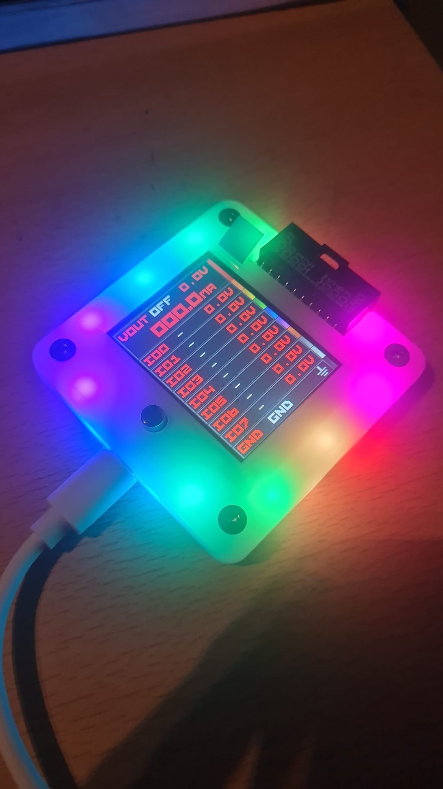
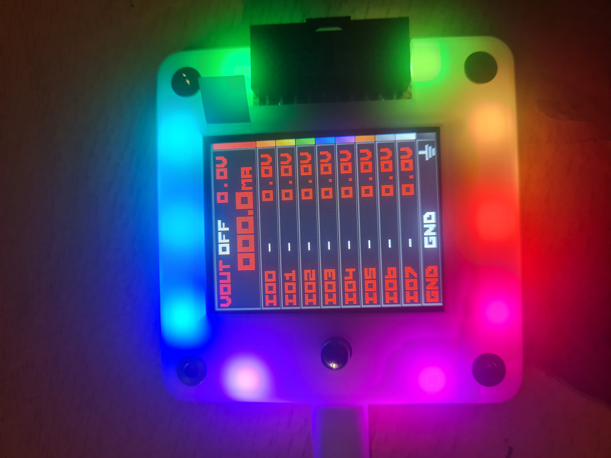
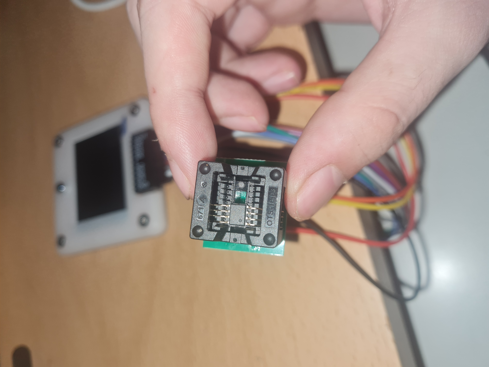
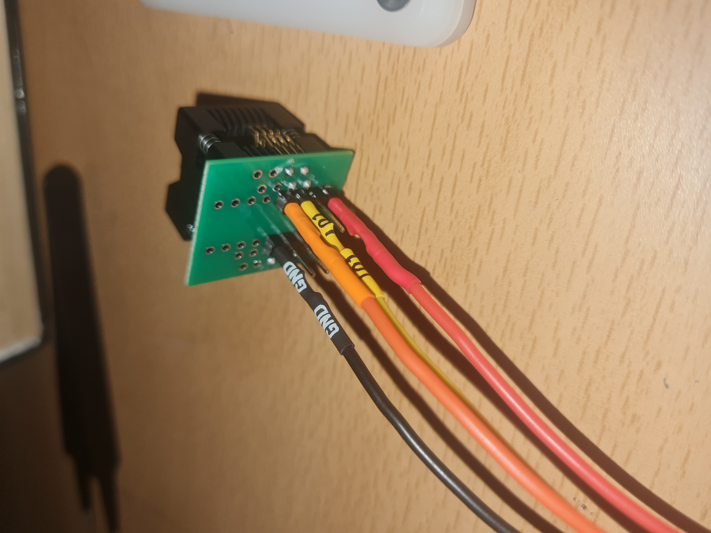
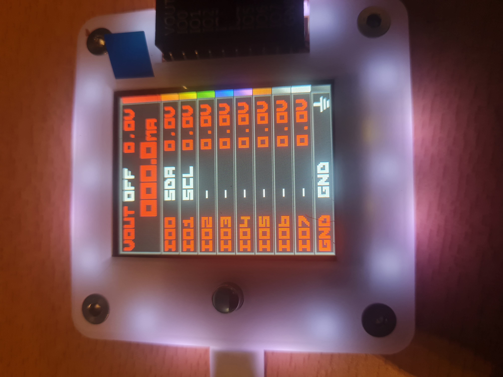
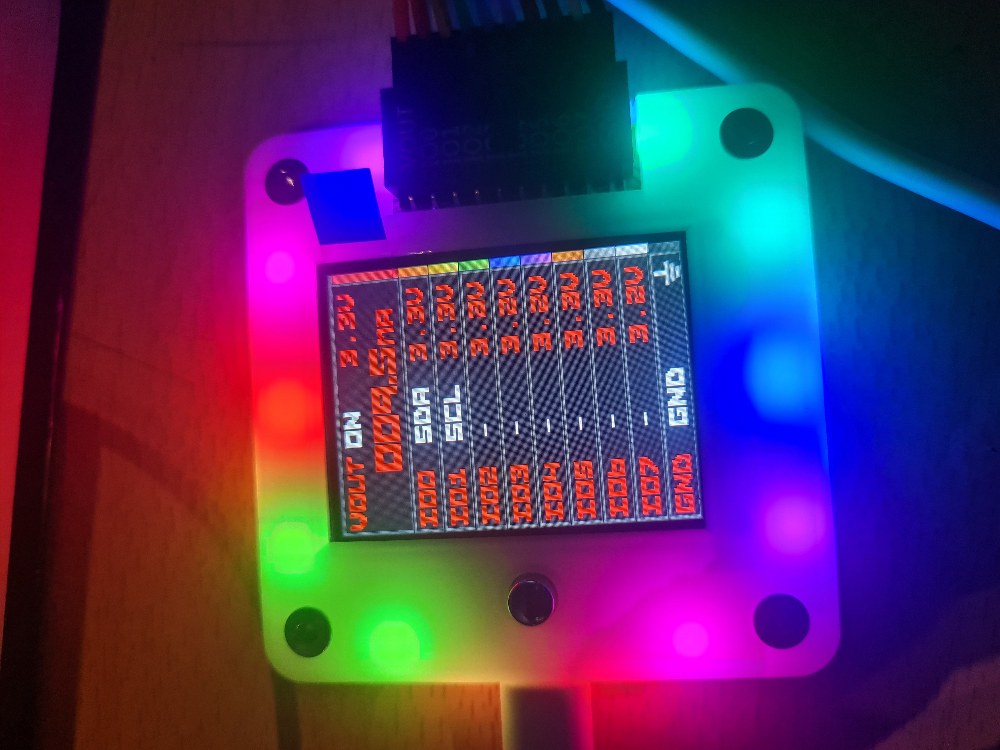

## Primera sesión con el Bus Pirate 6: Aprendiendo y confirmando el volcado del chip de la impresora

¡Buenas!

El otro día me llegó el bus pirate y tenía muchas ganas de probarlo. No estaba seguro de cuándo empezar porque tengo ahora mismo bastantes cosas pendientes, pero en una de esas noches que no apetece teoría profunda se me ocurrió que podría trastear con él por primera vez, ¿y qué mejor forma que confirmando el volcado de la EEPROM de la impresora que ya había en el repositorio? Vamos a matar dos pájaros de un tiro. 

Si con el trabajo de hoy podemos confirmar la teoría de lo que pasó, genial entonces. En la [sesión 01 con la impresora](https://github.com/unlinkedbyte/Hardware-hacking-learning-journey/blob/main/sesion-01-impresora/README.md), el primer volcado salió con las dos mitades idénticas por un fallo de la herramienta ch341eeprom, que se corrigió con la flag -c 0 (por el bit de la posición P0). 

La idea es releer el mismo chip con una herramienta distinta para ver si los dos volcados dan el mismo hash (lo cual nos confirmaría lo dicho). 

Quiero añadir que, pese a que intentaré explicar el porqué de todo lo más profundamente posible si lo requiere, no entraré a fondo en todo el Bus Pirate, te dejo la documentación aquí: [Bus pirate docs](https://docs.buspirate.com/docs/overview/hardware/). 

### Primera conexión

Primero vamos a conectar el bus pirate al ordenador, ver si le llega la corriente (y que todo esté bien) y hacer las comprobaciones pertinentes. El cable usb-c que uses tiene que pasar datos, no solo cargar. 

Para comprobar esto, usaremos el comando `sudo dmesg -w` mientras lo enchufamos. `dmesg` muestra los mensajes del kernel, y con -w veremos los eventos que vayan ocurriendo (como conectar un dispositivo).  
Antes de nada quiero mostrar el bus pirate ya que me parece chulísimo:



Como podemos ver por las luces, le llega corriente. Ahora lo que debemos comprobar es si el cable también pasa datos. Si el cable solo cargara, dmesg no nos mostraría nada. El output que verás es tremendo, pero si todo va bien deberías ver estas líneas:

```bash

[114828.709556] usb 3-2: new full-speed USB device number 5 using xhci_hcd
[114828.835248] usb 3-2: New USB device found, idVendor=1209, idProduct=7331, bcdDevice= 1.01
[114828.835264] usb 3-2: New USB device strings: Mfr=1, Product=2, SerialNumber=3
[114828.835268] usb 3-2: Product: Bus Pirate 6
[114828.835271] usb 3-2: Manufacturer: Bus Pirate
[114828.835274] usb 3-2: SerialNumber: 6buspirate
[114828.886234] cdc_acm 3-2:1.0: ttyACM0: USB ACM device
[114828.886694] cdc_acm 3-2:1.2: ttyACM1: USB ACM device
[114828.886733] usbcore: registered new interface driver cdc_acm
[114828.886736] cdc_acm: USB Abstract Control Model driver for USB modems and ISDN adapters
[114828.921963] SCSI subsystem initialized
[114828.941192] usb-storage 3-2:1.4: USB Mass Storage device detected
[114828.941950] scsi host0: usb-storage 3-2:1.4
[114828.942168] usbcore: registered new interface driver usb-storage
[114828.954047] usbcore: registered new interface driver uas
[114829.977168] scsi 0:0:0:0: Direct-Access     BP6      Storage          1.0  PQ: 0 ANSI: 2
[114829.999521] scsi 0:0:0:0: Attached scsi generic sg0 type 0
[114830.024415] sd 0:0:0:0: [sda] 47824 2048-byte logical blocks: (97.9 MB/93.4 MiB)
[114830.025868] sd 0:0:0:0: [sda] Write Protect is off
[114830.025880] sd 0:0:0:0: [sda] Mode Sense: 03 00 00 00
[114830.026841] sd 0:0:0:0: [sda] No Caching mode page found
[114830.026848] sd 0:0:0:0: [sda] Assuming drive cache: write through
[114830.061063]  sda: sda1
[114830.061433] sd 0:0:0:0: [sda] Attached SCSI removable disk
```

Las cosas en las que nos deberíamos fijar aquí son en el `Product: Bus pirate 6`, que es que el aparato se ha reconocido, ttyACM0 y ttyACM1 que el primero es la terminal donde escribiremos comandos y el segundo una interfaz para programas como el analizador lógico, y `sda: sda1` la memoria interna del bus pirate que aparece como unidad USB. 

Luego podemos ejecutar este comando a modo de comprobación extra:

```bash
ls -l /dev/ttyACM*
crw-rw---- root dialout 0 B Thu Oct  1 19:14:34 2026  /dev/ttyACM0
crw-rw---- root dialout 0 B Thu Oct  1 19:14:34 2026  /dev/ttyACM1
```

*(en mi sistema ls es un alias de lsd)*

Me puse en el grupo de dialout para no tener que estar usando sudo todo el rato, pero queda a elección tuya. 

¿Por qué `/dev/tty*`?

`tty` es el prefijo genérico de los terminales, viene de `teletypewriter`, los teletipos antiguos. Lo que va detrás indica el tipo de puerto o el controlador:

- ttyS0: puertos serie de los que van en la placa base por así decirlo.
- ttyUSB0: adaptadores USB-serie con un chip propio (como los típicos adaptadores USB-UART que se usan para las consolas de los routers).
- ttyACM0: para los aparatos que hablan USB directamente siguiendo un estándar llamado CDC ACM. 
- el número: indica el orden en que se han detectado.

La `c` que vemos al principio de los permisos indica el tipo de archivo (un dispositivo de caracteres).

### Usando tio

Yo uso Linux (lo digo porque en Windows usarías otros programas rollo tera term). La verdad, no hay ningún motivo en concreto por el que use `tio`, al leer un poco vi que no requería ninguna configuración por lo que simplemente me decanté por ese. También porque se reconecta solo si el bus pirate se reinicia o desenchufa. Que yo conozca ahora mismo están también picocom o minicom. Lee y decide. 

¿Qué es tio?

`tio` es un programa que abre el puerto serie (en nuestro caso ttyACM0) y nos deja escribir comandos y ver las respuestas. 

Para usarlo, a modo de introducción breve y rápida es esta: lo instalas con `sudo apt install tio`, lo conectas con `tio /dev/ttyACM0` y sales de él usando Ctrl+t y luego q.

Cuando se conecta, sale esto:

```bash
tio /dev/ttyACM0 
[20:01:59.393] tio 3.9
[20:01:59.393] Press ctrl-t q to quit
[20:01:59.393] Connected to /dev/ttyACM0
```

En este momento, le das a enter y te saldrá esto: 

```bash
VT100 compatible color mode? (Y/n)> 
```

Le das a `y` y ya tienes la terminal abierta.

*NOTA: Para borrar caracteres usas ctrl+h. Pero si no, puedes usar el comando `tio --map ODELBS /dev/ttyACM0` y borrarías con el delete normal. Si ves que al iniciar no te aparece la barra de estado en la parte baja de la terminal (que muestra el voltaje de cada pin), usa el comando cls y debería solucionarse.*

Este sería el prompt:

```bash
HiZ> 
```

En este momento, en la pantalla del bus pirate deberías ver esto:



Para cerrar esta sección, añadir que con el comando `i` ves la información del aparato (versión del firmware por ejemplo y algunas cosillas más) y con `?` ves todos los comandos disponibles.

### Datasheet y cableado

Un datasheet (hoja de datos) es el documento técnico que publica el fabricante de un componente para explicar qué es y cómo se usa. Es, básicamente, el manual de instrucciones del chip. Cada modelo tiene el suyo, y dos chips que hacen lo mismo pero son de fabricantes distintos pueden tener diferencias.

Lo consultas para no conectar a ciegas (si te equivocas de pata, en el mejor caso no funciona y en el peor quemas el chip), para saber qué voltaje aguanta y para entender cómo se comporta.

Para encontrar el datasheet buscas lo que lleva impreso el chip (la serigrafía. Por ejemplo 24C04WI datasheet). Para leerlo sin agobiarte, por regla general, puedes empezar por la primera página (donde resume las características y el patillaje). Luego miras los límites eléctricos y la descripción de las patas, y después solo las secciones que necesites para lo que vayas a hacer.

En nuestro caso el chip funciona de 1.8 a 5.5v, así que lo alimentaremos a 3.3v. Solo nos harán falta 4 patas: VCC, masa (VSS), SDA y SCL. A1, A2 y WP tienen resistencias pull-down internas, así que sin conectar valen 0. A1 y A2 sirven para cambiar la dirección del chip cuando hay varios en el bus, y WP en alto protege la memoria contra escritura. Como solo vamos a leer un solo chip, no nos hacen falta. 

La pata de VCC (la 8) es la alimentación (por aquí recibe el chip la corriente. Va a VOUT del Bus pirate, el cable rojo, que dará los 3.3v). 

La pata del VSS (la 4) es la masa (0v). Es la referencia contra la que se miden todos los voltajes. El bus pirate y el chip tienen que compartir masa, sin ella, un 3.3v no significaría nada porque no habría nada contra qué medirlo. Va a GND (el cable negro). 

La pata SCL (la 6) es el reloj. Lo genera el bus pirate, cada pulso marca el momento en que se lee un bit. Va a IO1.

La pata SDA (la 5) es la de los datos. Por ahí viajan los bits en las dos direcciones (el bus pirate envía direcciones y órdenes, y el chip devuelve los datos). Va a IO0. 

En modo I2C el bus pirate asigna SDA a IO0 y SCL a IO1. I2C usa solo dos cables de señal (reloj y datos) más alimentación y masa.

Dejo un diagrama (la O es la muesca que nos indica que es la pata número 1):

```text
                    ___________
                   |           | 
            1 ---- | O         | ----- 8 VOUT (roja)
                   |           |
            2 ---- |           | ----- 7
                   |           |
            3 ---- |           | ----- 6 SCL (IO1)
                   |           |
GND (negra) 4 ---- |           | ----- 5 SDA (IO0)
                   |___________| 


```

Dejo un par de fotos de como ha quedado el cableado:





### Configurando el Bus Pirate: I2C, alimentación y pull-ups

Ahora toca volver a enchufar el bus pirate con el zócalo conectado. Al abrir tio, debemos escribir el comando `m`, que nos listará todos los modos: 

```bash
HiZ> m

Mode selection
 1. HiZ
 2. 1WIRE
 3. UART
 4. HDUART
 5. I2C
 6. SPI
 7. 2WIRE
 8. 3WIRE
 9. DIO
 10. LED
 11. INFRARED
 12. JTAG
 x. Exit
Mode > 
```

Introducimos el número 5 y nos saldrá esto: 

```bash
I2C speed
 1kHz to 1000kHz
 x. Exit
kHz (400kHz*) > 
```

Esta es la velocidad. El datasheet garantizaba 100 kHz en todo el rango de voltaje, por lo que usaremos 100 kHz. 

Luego, nos aparecerá esto:

```bash
kHz (400kHz*) > 100
Clock stretching
 1. OFF*
 2. ON
 x. Exit
OFF (1) > 
```

El clock stretching lo dejaremos en OFF. Es un mecanismo con el que el esclavo mantiene el reloj en bajo para decirle al maestro "espera, que no he terminado". Las EEPROM no lo usan, por eso lo dejamos en OFF.

En este momento, el prompt habrá cambiado de `HiZ>` a `I2C>`. 

Para comprobar que todo ha ido bien, vamos a usar el comando `i`. Nos devuelve esto:

```bash

I2C> i

This device complies with part 15 of the FCC Rules. Operation is subject to the following two conditions:
(1) this device may not cause harmful interference, and 
(2) this device must accept any interference received, including interference that may cause undesired operation.

Bus Pirate 6
https://BusPirate.com/
Firmware main branch @ 985173b (Jan 29 2026 16:31:10)
RP2350B with 512KB RAM, 128Mbit FLASH
S/N: ------------------
Storage:   0.10GB (FAT16 File System)

Configuration file: Not Detected
Active binmode: SUMP logic analyzer
Available modes: HiZ 1WIRE UART HDUART I2C SPI 2WIRE 3WIRE DIO LED INFRARED JTAG
Active mode: I2C
 I2C speed: 100 kHz
 Clock stretching: OFF 

Display format: Auto
Data format: 8 bits, MSB bitorder
Pull-up resistors: OFF
Power supply: OFF
Frequency generators: OFF
```

Vemos como los cambios se han guardado correctamente. Ahora, en la pantalla del bus pirate nos aparece esto:



El siguiente paso es la alimentación. Para este paso, usaremos el comando `W`. Esto es lo que nos devuelve:

```bash
I2C> W
Power supply
Volts (0.80V-5.00V)
x to exit (3.30) > 
```

Podríamos pulsar enter y valdría, el valor que sale entre paréntesis es el predeterminado, pero vamos a escribir 3.3 (así, tal cual). Al hacerlo, nos pedirá la corriente máxima: 

```bash
Maximum current (1mA-500mA), 0 for unlimited
x to exit (300.00) > 
```

¿Qué es el maximum current?

Bueno, es una medida de seguridad. Si imaginamos un circuito como una tubería de agua, el voltaje es la presión con la que la empujas y la corriente es la cantidad de agua que pasaría por la tubería. 

El chip solo consume la corriente que necesita, que leyendo es como mucho 1mA según el datasheet. Pero si algo va mal (por ejemplo un cable en la pata equivocada o un cortocircuito), la corriente se dispara. Con el límite, si el consumo se supera, el bus pirate corta la alimentación, así protege al chip, al propio bus pirate y a los cables. 

Yo voy a usar 50mA. Es bastante más de lo que se consume en condiciones normales, así que en condiciones normales no saltará. Y, a la vez, es lo bastante bajo como para cortar enseguida si hay un problema. 

Esto es lo que nos devuelve: 

```bash
x to exit (300.00) > 50
3.30V requested, closest value: 3.30V
50.0mA requested, closest value: 50.0mA
Undervoltage limit: 2.96V (10%)

Power supply:  Enabled
Vreg output: 3.3V, Vref/Vout pin: 3.3V, Current: 8.1mA
```

En este preciso momento, el VOUT en la pantalla del bus pirate nos aparece como ON y marca 3.3v. Además, nos sale a 8.5-10.4 mA. Todo lo demás nos marca todavía 0.0v. 

Ahora toca activar las pull-ups con `P`:

```bash
I2C> P
Pull-up resistors: Enabled (10K ohms @ 3.3V)
```

¿Por qué hacen falta? En I2C, los dispositivos solo pueden tirar de las líneas hacia 0 V o soltarlas; nadie las empuja a 1 (esto se llama open-drain). Las pull-ups son resistencias que unen SDA y SCL a VOUT. En reposo mantienen las líneas a 3.3v (un 1), y cuando un dispositivo tira hacia abajo, se leen como 0. Sin ellas, las líneas se quedan a 0v, que es justo lo que marcaba la pantalla hace un momento. Debo decir que todavía debo aprender mucho más a fondo todo esto, pero es una breve introducción.

Una vez activadas, para que no haya tanta foto que al final sería lo mismo, he usado el comando `v` para que nos muestre todos los voltajes. Lo que vamos a ver es lo mismo que marca la pantalla del bus pirate:

```bash
I2C> v
1.Vout	2.IO0	3.IO1	4.IO2	5.IO3	6.IO4	7.IO5	8.IO6	9.IO7	10.GND	
8.6mA	SDA 	SCL	    -	  	-		-       -       -   	-       GND	
3.3V	3.2V	3.2V	3.2V	3.3V	3.3V	3.3V	3.2V	3.2V	GND
```

Pese a que salen a 3.2 SDA y SCL, no pasa nada. Me va bailando entre 3.2 y 3.3v todos los pines.  

### Buscando el chip: `scan`

Con todo ya configurado, lo primero es comprobar que el bus pirate "ve" el chip. Eso lo hacemos con el comando `scan`, que llama una por una a todas las direcciones I2C posibles y apunta cuáles contestan. Este es el output:

```bash
I2C> scan
I2C address search:
0x50 (0xA0 W) (0xA1 R)
0x51 (0xA2 W) (0xA3 R)

Found 4 addresses, 2 W/R pairs.
```

¿Por qué cada dirección sale dos veces y nos pone que ha encontrado 4 direcciones?

Cuando el bus pirate quiere hablar con el chip, lo primero que envía por el bus es un byte (8 bits). En ese byte van dos cosas:

- La dirección del chip, que ocupa 7 bits.
- Lo que quiere hacer (el bit de más al final. 0 significa escribir y 1 significa leer).

Es como llamar a alguien por su nombre y añadir si le vas a dar algo o pedírselo.

La dirección del chip es 0x50, que en binario son 7 bits (1010000). Si le pegas un 0 al final (escribir), queda 10100000, que es 0xA0. Si le pegaras el 1 (leer), queda 10100001, que es 0xA1.

Así que 0xA0 y 0xA1 son la misma dirección, 0x50, con escribir o leer pegado detrás. `scan` nos enseña ambas formas. 

¿Por qué un solo chip responde en dos direcciones?

Básicamente, nuestro chip tiene 512 casillas, y para pedirle una le indicas su número. 

Ese número va en un byte, y un byte solo puede contar de 0 a 255, que son 256 valores (nos falta la mitad). La solución del fabricante fue partir la memoria en dos "cajones" de 256 valores y usar el último bit de la dirección del chip para elegir el bloque:

- 0x50 (1010000) es el primer bloque (el 0), de 0 a 255.
- 0x51 (1010001)  es el segundo bloque (el 1), de 256 a 511.

Podríamos decir que son solo dos nombres para indicar el bloque y por eso el scan nos muestra 2 direcciones (que cada una sale con su version de lectura y escritura, por eso son 4, 2 pares), 0xA0/0xA1 para el bloque 0 y 0xA2/0xA3 para el bloque 1. 

En la sesión 01 de la impresora (enlazado al principio), ese último bit que elige el bloque (el bit P0) ch341eeprom lo dejaba siempre a 1, por eso nos daba siempre el bloque 1 (que lo comprobaremos luego) y nos salían las dos mitades iguales.

### Lectura manual

Una vez buscado el chip con scan, vamos a leer por ejemplo a mano una casilla concreta del cajón 0 y luego la misma casilla del cajón 1. En el datasheet, en la página 8, en el apartado *Selective Read* nos indica que se hace en dos pasos:

- 1: Ponemos el "dedo" en la casilla. Le decimos al chip "en el cajón 0 ve a X casilla". Para eso usaremos la dirección de escribir (0xA0), pero solo enviamos el número de casilla, sin datos. El chip moverá su "cursor" (un puntero interno) a esa posición.
- 2: Leeremos desde ahí. Volveremos a llamar al chip, ahora con la dirección de leer (0xA1) y le pedimos los bytes que queramos a partir de donde está el puntero.

El comando sería este (por ejemplo):

```bash
[0xA0 0x40][0xA1 r:16]
```

Vamos a hacer un desglose:

- [ : START ("empiezo a hablar").
- 0xA0: cajón 0, modo escribir.
- 0x40: la casilla 0x40, que es la 64 en decimal.
- ] : STOP (termina ahí).
- [0xA1: START otra vez, cajón 0, modo leer.
- r:16; "read 16 bytes". Lee 16 bytes.
- ] : stop.

Elegimos la casilla 0x40 aunque podría ser cualquiera. En nuestro caso, hay datos en ambos bloques, por lo que la comparación se verá clara.

Ojo, que esta sintaxis es la del bus pirate en modo I2C. En otros modos los mismos símbolos existen, pero hacen lo que toca en ese protocolo. 

Y ojo con otra cosa: para escribir en el chip se usa exactamente el mismo comando pero con datos detrás. El chip toma el primer byte después de 0xA0 como casilla, y todo lo que venga después como datos para guardar ahí. Por ejemplo, [0xA0 0x40] solo mueve el puntero, pero [0xA0 0x40 0x12] guardaría un 0x12 en la casilla 0x40, borrando lo que hubiera. Como WP no está conectado nada lo impide, así que conviene revisar el comando antes de darle a enter. Si fallas con la sintaxis, en ese caso, no pasaría nada, el bus pirate comprueba la línea entera antes de enviarla y, si hay un error, no la envía.

El output del comando anterior es este: 

```bash
I2C> [0xA0 0x40][0xA1 r:16]

I2C START
TX: 0xA0 ACK 0x40 ACK 
I2C STOP
I2C START
TX: 0xA1 ACK 
RX: 0xFC ACK 0x01 ACK 0x1E ACK 0x45 ACK 0x00 ACK 0x4E ACK 0x43 ACK 0x54 ACK 
    0x1E ACK 0x08 ACK 0x68 ACK 0x46 ACK 0xC6 ACK 0x66 ACK 0x88 ACK 0x28 NACK 
    
I2C STOP
```

Como vemos, en start, el bus pirate empieza a hablar. TX es lo que envía el bus pirate. Después de cada byte, el chip contesta ACK, que significa "recibido". Primero confirma que está ahí y que lo has llamado en modo escribir, y después que ha recibido la casilla (se explica en la página 4 del datasheet).

Luego, el I2C STOP nos indica que es el fin de la primera parte, por lo que el puntero ya apunta a la casilla 0x40. Ahora `TX: 0xA1 ACK` está en modo leer, y el chip lo confirma. RX es lo que recibe el bus pirate, los 16 bytes que le hemos indicado de las casillas 0x40 a 0x4F del bloque 0.

*En la línea RX los ACK los pone el bus pirate. El NACK del último byte es el bus pirate diciendo "no quiero más".*

Vamos a comprobar si los bytes coinciden con el dump_c0.bin del writeup de la impresora:

```bash
xxd -g 1 -s 0x40 -l 16 dump_c0.bin

00000040: fc 01 1e 45 00 4e 43 54 1e 08 68 46 c6 66 88 28  ...E.NCT..hF.f.(
```

Como podemos ver, coincide cada byte del volcado bueno (que en ese directorio también subí el primer .bin que extrajo el bloque 1 dos veces). 

Vamos ahora con el bloque 1, empezamos por el bus pirate: 

```bash
I2C> [0xA2 0x40][0xA3 r:16]

I2C START
TX: 0xA2 ACK 0x40 ACK 
I2C STOP
I2C START
TX: 0xA3 ACK 
RX: 0xAC ACK 0xED ACK 0x01 ACK 0xFD ACK 0x03 ACK 0xF1 ACK 0x03 ACK 0x46 ACK 
    0x04 ACK 0x71 ACK 0x04 ACK 0x01 ACK 0x05 ACK 0xBD ACK 0x02 ACK 0x80 NACK 
    
I2C STOP
```

Y la comprobación con el dump_c0.bin:

```bash
xxd -g 1 -s 0x140 -l 16 dump_c0.bin

00000140: ac ed 01 fd 03 f1 03 46 04 71 04 01 05 bd 02 80  .......F.q......
```

0x140 porque en el archivo del volcado bueno, el cajón 1 empieza en el byte 256, que en hexadecimal es 0x100. Así que la casilla 0x40 está 0x40 posiciones por delante (0x100 + 0x40).

Genial, todo ha ido correctamente por el momento. Vamos a hacer una comprobación extra para que veamos que ch341eeprom extrajo el bloque 1 dos veces, deberían coincidir:

```bash
xxd -g 1 -s 0x40 -l 16 dump1.bin

00000040: ac ed 01 fd 03 f1 03 46 04 71 04 01 05 bd 02 80  .......F.q......
```

Voy a poner los hashes también:

```bash
md5sum dump1.bin dump_c0.bin 
2d845091c92109e6e3bebcac79a9b264  dump1.bin
47d56569715c12f6cbc14eeb1b06549c  dump_c0.bin
```

Aunque está ya un poco claro lo que vamos a confirmar, la conclusión la veremos en la siguiente sección.

Voy a añadir esta foto igualmente para que tengamos certeza de lo que veríamos en el bus pirate:



### El volcado

Hasta ahora hemos leído casillas sueltas a mano. Para leer los 512 de unn vez, el bus pirate tiene el comando `eeprom`, que hace por nosotros todo lo que acabamos de ver (recorre los dos bloques, coloca el puntero y lee).

El comando:

```bash
eeprom read -d 24x04 -f bpdump.bin -v
```

Desglose del comando:

- eeprom read: lee la EEPROM entera y la guarda en un archivo.
- -d 24x04: el modelo del chip, equivalente a -s 24c04 de ch341eeprom. Con esto sabe cuántos bloques tiene y cómo pedir las casillas.
- -f bpdump.bin: el archivo de destino, en la memoria interna del bus pirate. 
- -v: verify. Cuando termina, vuelve a leer el chip y lo compara con el archivo. 

El output: 

```bash
I2C> eeprom read -d 24x04 -f bpdump.bin -v

24X04: 512 bytes,  1 block select bits, 1 byte address, 16 byte pages

Read: Reading EEPROM to file bpdump.bin...
Progress: [##################################################] 100.00%
Read complete
Read verify...
Progress: [##################################################] 100.00%
Read verify complete
Success :)
```

Ahora lo que vamos a hacer es montar el bus pirate para poder extraer el .bin y pasarlo a nuestra máquina. Simplemente he usado el comando `udisksctl mount -b /dev/sda1`. Cuando termina, te dice dónde lo monta. De ahí, lo pasamos a nuestra máquina con el comando cp y ya estaría. Una vez terminado, hay que desmontarlo antes de desenchufar el bus pirate con `udisksctl unmount -b /dev/sda1`.

Aquí tenemos el resultado con los hashes:

```bash
md5sum BPDUMP.BIN proyectos/hardware-hacking-journey/sesion-01-impresora/dump_c0.bin 

47d56569715c12f6cbc14eeb1b06549c  BPDUMP.BIN
47d56569715c12f6cbc14eeb1b06549c  proyectos/hardware-hacking-journey/sesion-01-impresora/dump_c0.bin
```

Con esto, podemos confirmar el error de ch341eeprom, y tenemos el volcado correcto, confirmado por dos herramientas distintas. El problema era el bit del bloque clavado a 1. 

Para desenchufar todo, simplemente desmontamos como acabo de decir, vamos a `tio` y seleccionamos el modo con `m`, seleccionamos el 1 que es HiZ (apagará la alimentación y las pull-ups, la pantalla del bus pirate y la barra de estado de los pines en tio nos marcará 0) y salimos de `tio` con ctrl+t y luego q. 


